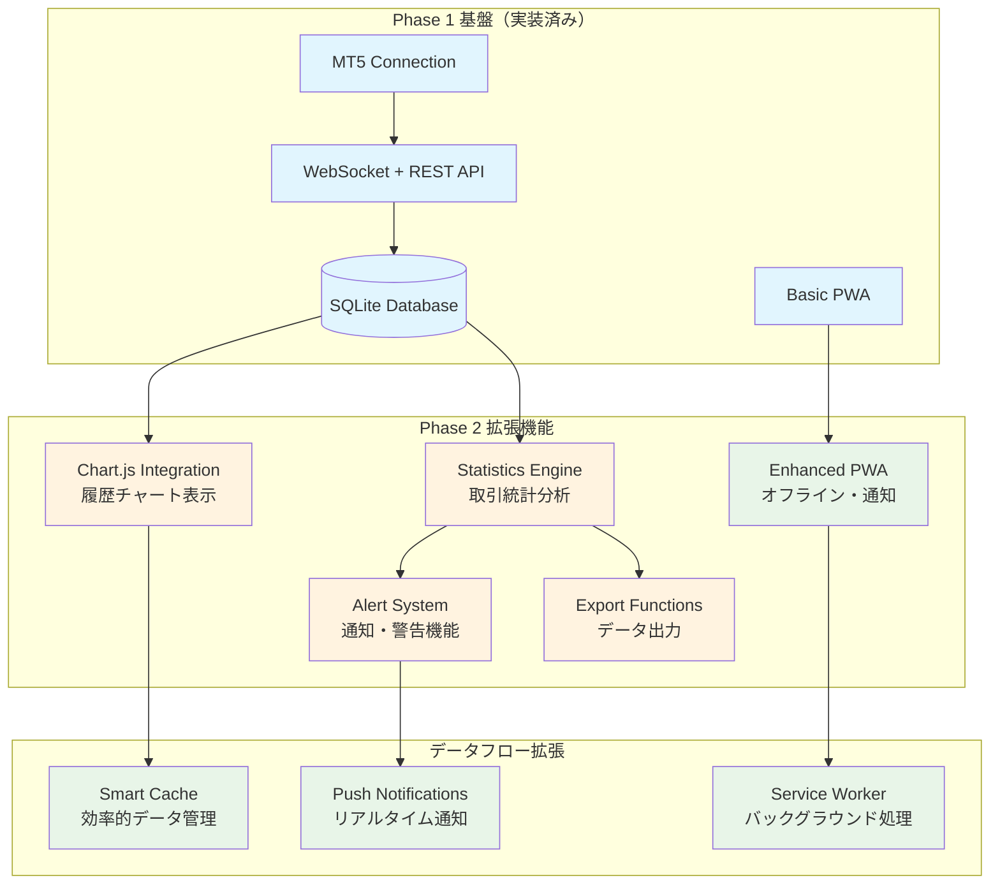

# JamesORB監視ダッシュボード Phase 2拡張機能設計書 v1.0

**作成日時**: 2025年7月27日 19:10 JST  
**作成者**: Kiro AI IDE  
**対象**: JamesORBデモ取引監視ダッシュボード Phase 2  
**目的**: 履歴チャート・統計・アラート・PWA拡張機能の詳細設計

## システム拡張アーキテクチャ

### Phase 2 機能拡張図



## 1. 履歴チャート表示機能設計

### Chart.js統合アーキテクチャ

#### チャート種別・仕様
```yaml
価格チャート:
  - 時間軸: 1時間・4時間・日足・週足
  - チャートタイプ: ローソク足・ライン・エリア
  - インジケーター: 移動平均・ボリンジャーバンド
  - リアルタイム更新: WebSocket経由

口座推移チャート:
  - 残高推移: 時系列グラフ
  - 証拠金推移: エリアチャート
  - 利益・損失: 棒グラフ・累積グラフ
  - ドローダウン: 専用表示

パフォーマンスチャート:
  - 日次・週次・月次収益
  - 勝率推移・連勝連敗
  - リスクリターン散布図
  - 時間帯別パフォーマンス
```

#### Chart.js カスタマイズ仕様
```javascript
// チャート基本設定
const chartConfig = {
    type: 'line',
    data: {
        labels: [], // 時間軸データ
        datasets: [{
            label: '口座残高',
            data: [],
            borderColor: '#2196F3',
            backgroundColor: 'rgba(33, 150, 243, 0.1)',
            tension: 0.4,
            pointRadius: 0,
            pointHoverRadius: 6
        }]
    },
    options: {
        responsive: true,
        maintainAspectRatio: false,
        interaction: {
            intersect: false,
            mode: 'index'
        },
        plugins: {
            legend: {
                display: true,
                position: 'top',
                labels: {
                    usePointStyle: true,
                    padding: 20,
                    font: {
                        size: 12
                    }
                }
            },
            tooltip: {
                backgroundColor: 'rgba(0, 0, 0, 0.8)',
                titleColor: '#fff',
                bodyColor: '#fff',
                borderColor: '#2196F3',
                borderWidth: 1,
                displayColors: false,
                callbacks: {
                    title: function(context) {
                        return formatDateTime(context[0].label);
                    },
                    label: function(context) {
                        return `残高: ¥${formatCurrency(context.parsed.y)}`;
                    }
                }
            }
        },
        scales: {
            x: {
                type: 'time',
                time: {
                    displayFormats: {
                        hour: 'MM/DD HH:mm',
                        day: 'MM/DD',
                        week: 'MM/DD',
                        month: 'YYYY/MM'
                    }
                },
                grid: {
                    display: false
                },
                ticks: {
                    maxTicksLimit: 6,
                    font: {
                        size: 10
                    }
                }
            },
            y: {
                beginAtZero: false,
                grid: {
                    color: 'rgba(0, 0, 0, 0.1)'
                },
                ticks: {
                    callback: function(value) {
                        return '¥' + formatCurrency(value);
                    },
                    font: {
                        size: 10
                    }
                }
            }
        }
    }
};

// モバイル最適化設定
const mobileOptimizations = {
    // タッチ操作対応
    interaction: {
        intersect: false,
        mode: 'nearest',
        axis: 'x'
    },
    // パフォーマンス最適化
    animation: {
        duration: 300 // 短縮
    },
    // データ間引き（大量データ対応）
    elements: {
        point: {
            radius: 0 // ポイント非表示でパフォーマンス向上
        },
        line: {
            tension: 0 // 直線でパフォーマンス向上
        }
    }
};
```

#### データ管理・更新システム
```python
class ChartDataManager:
    def __init__(self):
        self.cache = {}
        self.max_points = 1000  # メモリ制限
        
    def get_price_history(self, symbol, timeframe, limit=100):
        """価格履歴データ取得"""
        cache_key = f"{symbol}_{timeframe}_{limit}"
        
        if cache_key in self.cache:
            return self.cache[cache_key]
            
        # MT5からデータ取得
        rates = mt5.copy_rates_from_pos(symbol, timeframe, 0, limit)
        
        if rates is not None:
            data = {
                'labels': [datetime.fromtimestamp(rate['time']) for rate in rates],
                'open': rates['open'].tolist(),
                'high': rates['high'].tolist(),
                'low': rates['low'].tolist(),
                'close': rates['close'].tolist(),
                'volume': rates['tick_volume'].tolist()
            }
            
            # キャッシュ保存（メモリ制限考慮）
            if len(self.cache) < 10:
                self.cache[cache_key] = data
                
            return data
        return None
    
    def get_account_history(self, period_hours=24):
        """口座履歴データ取得"""
        query = """
        SELECT timestamp, balance, equity, margin, free_margin, profit
        FROM account_history 
        WHERE timestamp >= datetime('now', '-{} hours')
        ORDER BY timestamp
        """.format(period_hours)
        
        cursor = db.execute(query)
        rows = cursor.fetchall()
        
        return {
            'labels': [row['timestamp'] for row in rows],
            'balance': [row['balance'] for row in rows],
            'equity': [row['equity'] for row in rows],
            'margin': [row['margin'] for row in rows],
            'profit': [row['profit'] for row in rows]
        }
    
    def update_realtime_data(self, chart_id, new_data):
        """リアルタイムデータ更新"""
        # WebSocket経由でクライアントに送信
        socketio.emit('chart_update', {
            'chart_id': chart_id,
            'data': new_data,
            'timestamp': datetime.now().isoformat()
        })
```

### レスポンシブ・モバイル最適化
```css
/* チャートコンテナ最適化 */
.chart-container {
    position: relative;
    height: 300px;
    width: 100%;
    margin: 10px 0;
}

@media (max-width: 768px) {
    .chart-container {
        height: 250px;
        margin: 5px 0;
    }
    
    /* タッチ操作エリア拡大 */
    .chart-controls {
        padding: 15px;
        touch-action: manipulation;
    }
    
    /* フォントサイズ調整 */
    .chart-legend {
        font-size: 12px;
    }
    
    /* スクロール最適化 */
    .chart-wrapper {
        overflow-x: auto;
        -webkit-overflow-scrolling: touch;
    }
}
```

## 2. 取引履歴・統計情報機能設計

### データベーススキーマ拡張
```sql
-- 取引統計テーブル
CREATE TABLE trading_statistics (
    id INTEGER PRIMARY KEY AUTOINCREMENT,
    date DATE NOT NULL,
    total_trades INTEGER DEFAULT 0,
    winning_trades INTEGER DEFAULT 0,
    losing_trades INTEGER DEFAULT 0,
    gross_profit REAL DEFAULT 0,
    gross_loss REAL DEFAULT 0,
    net_profit REAL DEFAULT 0,
    profit_factor REAL DEFAULT 0,
    win_rate REAL DEFAULT 0,
    avg_win REAL DEFAULT 0,
    avg_loss REAL DEFAULT 0,
    max_consecutive_wins INTEGER DEFAULT 0,
    max_consecutive_losses INTEGER DEFAULT 0,
    max_drawdown REAL DEFAULT 0,
    sharpe_ratio REAL DEFAULT 0,
    created_at DATETIME DEFAULT CURRENT_TIMESTAMP
);

-- 日次パフォーマンステーブル
CREATE TABLE daily_performance (
    id INTEGER PRIMARY KEY AUTOINCREMENT,
    date DATE NOT NULL UNIQUE,
    starting_balance REAL NOT NULL,
    ending_balance REAL NOT NULL,
    daily_return REAL NOT NULL,
    daily_return_pct REAL NOT NULL,
    trades_count INTEGER DEFAULT 0,
    winning_trades INTEGER DEFAULT 0,
    max_drawdown_day REAL DEFAULT 0,
    volatility REAL DEFAULT 0
);

-- インデックス作成
CREATE INDEX idx_statistics_date ON trading_statistics(date);
CREATE INDEX idx_performance_date ON daily_performance(date);
```

### 統計計算エンジン
```python
class TradingStatistics:
    def __init__(self):
        self.db = sqlite3.connect('trading_data.db')
        self.db.row_factory = sqlite3.Row
    
    def calculate_basic_stats(self, start_date=None, end_date=None):
        """基本統計指標計算"""
        query = """
        SELECT * FROM position_history 
        WHERE timestamp BETWEEN ? AND ?
        AND profit IS NOT NULL
        """
        
        if not start_date:
            start_date = datetime.now() - timedelta(days=30)
        if not end_date:
            end_date = datetime.now()
            
        cursor = self.db.execute(query, (start_date, end_date))
        trades = cursor.fetchall()
        
        if not trades:
            return self._empty_stats()
        
        profits = [trade['profit'] for trade in trades]
        winning_trades = [p for p in profits if p > 0]
        losing_trades = [p for p in profits if p < 0]
        
        stats = {
            'total_trades': len(trades),
            'winning_trades': len(winning_trades),
            'losing_trades': len(losing_trades),
            'gross_profit': sum(winning_trades) if winning_trades else 0,
            'gross_loss': abs(sum(losing_trades)) if losing_trades else 0,
            'net_profit': sum(profits),
            'win_rate': len(winning_trades) / len(trades) * 100 if trades else 0,
            'avg_win': sum(winning_trades) / len(winning_trades) if winning_trades else 0,
            'avg_loss': abs(sum(losing_trades) / len(losing_trades)) if losing_trades else 0
        }
        
        # プロフィットファクター計算
        stats['profit_factor'] = (stats['gross_profit'] / stats['gross_loss'] 
                                 if stats['gross_loss'] > 0 else 0)
        
        # 最大連勝・連敗計算
        stats.update(self._calculate_consecutive_stats(profits))
        
        # 最大ドローダウン計算
        stats['max_drawdown'] = self._calculate_max_drawdown(trades)
        
        return stats
    
    def _calculate_consecutive_stats(self, profits):
        """連勝・連敗統計計算"""
        if not profits:
            return {'max_consecutive_wins': 0, 'max_consecutive_losses': 0}
        
        max_wins = current_wins = 0
        max_losses = current_losses = 0
        
        for profit in profits:
            if profit > 0:
                current_wins += 1
                current_losses = 0
                max_wins = max(max_wins, current_wins)
            elif profit < 0:
                current_losses += 1
                current_wins = 0
                max_losses = max(max_losses, current_losses)
            else:
                current_wins = current_losses = 0
        
        return {
            'max_consecutive_wins': max_wins,
            'max_consecutive_losses': max_losses
        }
    
    def _calculate_max_drawdown(self, trades):
        """最大ドローダウン計算"""
        if not trades:
            return 0
        
        # 累積損益計算
        cumulative_pnl = []
        running_total = 0
        
        for trade in sorted(trades, key=lambda x: x['timestamp']):
            running_total += trade['profit']
            cumulative_pnl.append(running_total)
        
        # 最大ドローダウン計算
        peak = cumulative_pnl[0]
        max_dd = 0
        
        for pnl in cumulative_pnl:
            if pnl > peak:
                peak = pnl
            drawdown = peak - pnl
            max_dd = max(max_dd, drawdown)
        
        return max_dd
    
    def calculate_sharpe_ratio(self, returns, risk_free_rate=0.02):
        """シャープレシオ計算"""
        if not returns or len(returns) < 2:
            return 0
        
        excess_returns = [r - risk_free_rate/252 for r in returns]  # 日次換算
        
        if not excess_returns:
            return 0
        
        mean_excess = sum(excess_returns) / len(excess_returns)
        
        # 標準偏差計算
        variance = sum((r - mean_excess) ** 2 for r in excess_returns) / len(excess_returns)
        std_dev = variance ** 0.5
        
        return (mean_excess / std_dev * (252 ** 0.5)) if std_dev > 0 else 0
    
    def generate_performance_report(self, period='month'):
        """パフォーマンスレポート生成"""
        stats = self.calculate_basic_stats()
        
        report = {
            'summary': stats,
            'period': period,
            'generated_at': datetime.now().isoformat(),
            'charts_data': {
                'profit_distribution': self._get_profit_distribution(),
                'monthly_performance': self._get_monthly_performance(),
                'hourly_performance': self._get_hourly_performance()
            }
        }
        
        return report
```

### 統計表示UI設計
```html
<!-- 統計ダッシュボード -->
<div class="statistics-dashboard">
    <!-- サマリーカード -->
    <div class="stats-summary">
        <div class="stat-card profit-factor">
            <h3>プロフィットファクター</h3>
            <div class="stat-value" id="profit-factor">1.25</div>
            <div class="stat-change positive">+0.15</div>
        </div>
        
        <div class="stat-card win-rate">
            <h3>勝率</h3>
            <div class="stat-value" id="win-rate">65.2%</div>
            <div class="stat-change positive">+2.1%</div>
        </div>
        
        <div class="stat-card max-dd">
            <h3>最大DD</h3>
            <div class="stat-value" id="max-drawdown">-8.5%</div>
            <div class="stat-change negative">-1.2%</div>
        </div>
    </div>
    
    <!-- 詳細統計テーブル -->
    <div class="detailed-stats">
        <table class="stats-table">
            <thead>
                <tr>
                    <th>指標</th>
                    <th>値</th>
                    <th>前期比</th>
                </tr>
            </thead>
            <tbody id="stats-table-body">
                <!-- 動的生成 -->
            </tbody>
        </table>
    </div>
    
    <!-- エクスポート機能 -->
    <div class="export-controls">
        <button class="btn-export" onclick="exportToCSV()">CSV出力</button>
        <button class="btn-export" onclick="exportToPDF()">PDF出力</button>
    </div>
</div>
```

## 3. アラート機能システム設計

### アラート条件・ルールエンジン
```python
class AlertSystem:
    def __init__(self):
        self.rules = []
        self.notification_history = []
        self.cooldown_periods = {}  # スパム防止
    
    def add_alert_rule(self, rule_config):
        """アラートルール追加"""
        rule = {
            'id': str(uuid.uuid4()),
            'name': rule_config['name'],
            'condition': rule_config['condition'],
            'threshold': rule_config['threshold'],
            'notification_type': rule_config.get('notification_type', 'popup'),
            'cooldown_minutes': rule_config.get('cooldown_minutes', 5),
            'enabled': True,
            'created_at': datetime.now()
        }
        self.rules.append(rule)
        return rule['id']
    
    def check_alerts(self, current_data):
        """アラート条件チェック"""
        triggered_alerts = []
        
        for rule in self.rules:
            if not rule['enabled']:
                continue
                
            # クールダウン期間チェック
            if self._is_in_cooldown(rule['id']):
                continue
            
            # 条件評価
            if self._evaluate_condition(rule, current_data):
                alert = self._create_alert(rule, current_data)
                triggered_alerts.append(alert)
                self._set_cooldown(rule['id'], rule['cooldown_minutes'])
        
        return triggered_alerts
    
    def _evaluate_condition(self, rule, data):
        """条件評価ロジック"""
        condition = rule['condition']
        threshold = rule['threshold']
        
        if condition == 'loss_threshold':
            current_loss = data.get('daily_loss', 0)
            return current_loss >= threshold
            
        elif condition == 'profit_target':
            current_profit = data.get('daily_profit', 0)
            return current_profit >= threshold
            
        elif condition == 'drawdown_warning':
            current_dd = data.get('current_drawdown', 0)
            return current_dd >= threshold
            
        elif condition == 'ea_stopped':
            ea_status = data.get('ea_status', 'running')
            return ea_status != 'running'
            
        elif condition == 'connection_error':
            connection_status = data.get('connection_status', True)
            return not connection_status
            
        return False
    
    def _create_alert(self, rule, data):
        """アラート作成"""
        alert = {
            'id': str(uuid.uuid4()),
            'rule_id': rule['id'],
            'rule_name': rule['name'],
            'message': self._generate_message(rule, data),
            'severity': self._determine_severity(rule),
            'timestamp': datetime.now(),
            'acknowledged': False
        }
        
        self.notification_history.append(alert)
        return alert
    
    def _generate_message(self, rule, data):
        """アラートメッセージ生成"""
        condition = rule['condition']
        threshold = rule['threshold']
        
        messages = {
            'loss_threshold': f"日次損失が{threshold:,.0f}円を超えました",
            'profit_target': f"利益目標{threshold:,.0f}円を達成しました",
            'drawdown_warning': f"ドローダウンが{threshold:.1f}%に達しました",
            'ea_stopped': "EA稼働が停止しました",
            'connection_error': "MT5接続エラーが発生しました"
        }
        
        return messages.get(condition, "アラート条件が満たされました")

# アラート設定のデフォルト値
DEFAULT_ALERT_RULES = [
    {
        'name': '大幅損失警告',
        'condition': 'loss_threshold',
        'threshold': 50000,  # 5万円
        'notification_type': 'push',
        'cooldown_minutes': 30
    },
    {
        'name': 'EA停止警告',
        'condition': 'ea_stopped',
        'threshold': 0,
        'notification_type': 'push',
        'cooldown_minutes': 5
    },
    {
        'name': 'ドローダウン警告',
        'condition': 'drawdown_warning',
        'threshold': 10.0,  # 10%
        'notification_type': 'popup',
        'cooldown_minutes': 60
    }
]
```

### プッシュ通知実装
```javascript
// Service Worker - プッシュ通知処理
self.addEventListener('push', function(event) {
    if (event.data) {
        const data = event.data.json();
        const options = {
            body: data.message,
            icon: '/static/icons/alert-icon.png',
            badge: '/static/icons/badge-icon.png',
            vibrate: [200, 100, 200],
            data: {
                alertId: data.id,
                timestamp: data.timestamp,
                url: '/dashboard'
            },
            actions: [
                {
                    action: 'view',
                    title: '確認',
                    icon: '/static/icons/view-icon.png'
                },
                {
                    action: 'dismiss',
                    title: '閉じる',
                    icon: '/static/icons/close-icon.png'
                }
            ]
        };
        
        event.waitUntil(
            self.registration.showNotification(data.title, options)
        );
    }
});

// 通知クリック処理
self.addEventListener('notificationclick', function(event) {
    event.notification.close();
    
    if (event.action === 'view') {
        event.waitUntil(
            clients.openWindow('/dashboard')
        );
    }
});

// クライアント側 - 通知許可・登録
class NotificationManager {
    constructor() {
        this.registration = null;
        this.subscription = null;
    }
    
    async initialize() {
        // Service Worker登録
        if ('serviceWorker' in navigator) {
            this.registration = await navigator.serviceWorker.register('/sw.js');
        }
        
        // 通知許可要求
        if ('Notification' in window) {
            const permission = await Notification.requestPermission();
            if (permission === 'granted') {
                await this.subscribeToPush();
            }
        }
    }
    
    async subscribeToPush() {
        if (!this.registration) return;
        
        try {
            this.subscription = await this.registration.pushManager.subscribe({
                userVisibleOnly: true,
                applicationServerKey: this.urlBase64ToUint8Array(VAPID_PUBLIC_KEY)
            });
            
            // サーバーに購読情報送信
            await fetch('/api/subscribe', {
                method: 'POST',
                headers: {
                    'Content-Type': 'application/json',
                },
                body: JSON.stringify(this.subscription)
            });
        } catch (error) {
            console.error('プッシュ通知登録エラー:', error);
        }
    }
    
    urlBase64ToUint8Array(base64String) {
        const padding = '='.repeat((4 - base64String.length % 4) % 4);
        const base64 = (base64String + padding)
            .replace(/-/g, '+')
            .replace(/_/g, '/');
        
        const rawData = window.atob(base64);
        const outputArray = new Uint8Array(rawData.length);
        
        for (let i = 0; i < rawData.length; ++i) {
            outputArray[i] = rawData.charCodeAt(i);
        }
        return outputArray;
    }
}
```

## 4. PWA拡張・オフライン機能設計

### Enhanced PWA Manifest
```json
{
    "name": "JamesORB Trading Dashboard",
    "short_name": "JamesORB",
    "description": "リアルタイム取引監視ダッシュボード",
    "start_url": "/dashboard",
    "display": "standalone",
    "orientation": "portrait-primary",
    "background_color": "#ffffff",
    "theme_color": "#2196F3",
    "categories": ["finance", "productivity"],
    "lang": "ja",
    "dir": "ltr",
    "icons": [
        {
            "src": "/static/icons/icon-72x72.png",
            "sizes": "72x72",
            "type": "image/png",
            "purpose": "maskable"
        },
        {
            "src": "/static/icons/icon-96x96.png",
            "sizes": "96x96",
            "type": "image/png",
            "purpose": "any"
        },
        {
            "src": "/static/icons/icon-128x128.png",
            "sizes": "128x128",
            "type": "image/png",
            "purpose": "any"
        },
        {
            "src": "/static/icons/icon-144x144.png",
            "sizes": "144x144",
            "type": "image/png",
            "purpose": "any"
        },
        {
            "src": "/static/icons/icon-152x152.png",
            "sizes": "152x152",
            "type": "image/png",
            "purpose": "any"
        },
        {
            "src": "/static/icons/icon-192x192.png",
            "sizes": "192x192",
            "type": "image/png",
            "purpose": "any"
        },
        {
            "src": "/static/icons/icon-384x384.png",
            "sizes": "384x384",
            "type": "image/png",
            "purpose": "any"
        },
        {
            "src": "/static/icons/icon-512x512.png",
            "sizes": "512x512",
            "type": "image/png",
            "purpose": "any"
        }
    ],
    "shortcuts": [
        {
            "name": "ダッシュボード",
            "short_name": "Dashboard",
            "description": "メインダッシュボードを開く",
            "url": "/dashboard",
            "icons": [
                {
                    "src": "/static/icons/dashboard-shortcut.png",
                    "sizes": "96x96"
                }
            ]
        },
        {
            "name": "統計",
            "short_name": "Stats",
            "description": "取引統計を表示",
            "url": "/dashboard#stats",
            "icons": [
                {
                    "src": "/static/icons/stats-shortcut.png",
                    "sizes": "96x96"
                }
            ]
        }
    ],
    "screenshots": [
        {
            "src": "/static/screenshots/dashboard-mobile.png",
            "sizes": "375x812",
            "type": "image/png",
            "form_factor": "narrow"
        }
    ]
}
```

### Advanced Service Worker
```javascript
const CACHE_NAME = 'jamesorb-dashboard-v2';
const STATIC_CACHE = 'static-v2';
const DYNAMIC_CACHE = 'dynamic-v2';

// キャッシュ戦略定義
const CACHE_STRATEGIES = {
    static: [
        '/',
        '/dashboard',
        '/static/css/dashboard.css',
        '/static/js/dashboard.js',
        '/static/js/chart.min.js',
        '/static/icons/',
        '/manifest.json'
    ],
    dynamic: [
        '/api/account',
        '/api/positions',
        '/api/statistics'
    ]
};

// インストール時の処理
self.addEventListener('install', event => {
    event.waitUntil(
        Promise.all([
            // 静的リソースキャッシュ
            caches.open(STATIC_CACHE).then(cache => {
                return cache.addAll(CACHE_STRATEGIES.static);
            }),
            // 動的キャッシュ初期化
            caches.open(DYNAMIC_CACHE)
        ])
    );
    self.skipWaiting();
});

// アクティベーション時の処理
self.addEventListener('activate', event => {
    event.waitUntil(
        caches.keys().then(cacheNames => {
            return Promise.all(
                cacheNames.map(cacheName => {
                    if (cacheName !== STATIC_CACHE && 
                        cacheName !== DYNAMIC_CACHE) {
                        return caches.delete(cacheName);
                    }
                })
            );
        })
    );
    self.clients.claim();
});

// フェッチ戦略
self.addEventListener('fetch', event => {
    const url = new URL(event.request.url);
    
    // API リクエストの処理
    if (url.pathname.startsWith('/api/')) {
        event.respondWith(handleApiRequest(event.request));
    }
    // 静的リソースの処理
    else if (CACHE_STRATEGIES.static.some(path => url.pathname.includes(path))) {
        event.respondWith(handleStaticRequest(event.request));
    }
    // その他のリクエスト
    else {
        event.respondWith(handleDynamicRequest(event.request));
    }
});

// API リクエスト処理（Network First）
async function handleApiRequest(request) {
    try {
        // ネットワーク優先
        const networkResponse = await fetch(request);
        
        if (networkResponse.ok) {
            // 成功時はキャッシュに保存
            const cache = await caches.open(DYNAMIC_CACHE);
            cache.put(request, networkResponse.clone());
        }
        
        return networkResponse;
    } catch (error) {
        // ネットワークエラー時はキャッシュから取得
        const cachedResponse = await caches.match(request);
        if (cachedResponse) {
            // オフライン状態をクライアントに通知
            self.clients.matchAll().then(clients => {
                clients.forEach(client => {
                    client.postMessage({
                        type: 'OFFLINE_MODE',
                        message: 'オフラインモードで動作中'
                    });
                });
            });
            return cachedResponse;
        }
        
        // フォールバック応答
        return new Response(JSON.stringify({
            error: 'オフライン',
            message: 'ネットワーク接続を確認してください'
        }), {
            status: 503,
            headers: { 'Content-Type': 'application/json' }
        });
    }
}

// 静的リソース処理（Cache First）
async function handleStaticRequest(request) {
    const cachedResponse = await caches.match(request);
    return cachedResponse || fetch(request);
}

// 動的リクエスト処理（Stale While Revalidate）
async function handleDynamicRequest(request) {
    const cache = await caches.open(DYNAMIC_CACHE);
    const cachedResponse = await cache.match(request);
    
    const fetchPromise = fetch(request).then(networkResponse => {
        if (networkResponse.ok) {
            cache.put(request, networkResponse.clone());
        }
        return networkResponse;
    });
    
    return cachedResponse || fetchPromise;
}

// バックグラウンド同期
self.addEventListener('sync', event => {
    if (event.tag === 'background-sync') {
        event.waitUntil(doBackgroundSync());
    }
});

async function doBackgroundSync() {
    try {
        // オフライン中に蓄積されたデータの同期
        const pendingData = await getStoredPendingData();
        
        for (const data of pendingData) {
            await fetch('/api/sync', {
                method: 'POST',
                body: JSON.stringify(data),
                headers: {
                    'Content-Type': 'application/json'
                }
            });
        }
        
        // 同期完了後、保存データをクリア
        await clearStoredPendingData();
        
    } catch (error) {
        console.error('バックグラウンド同期エラー:', error);
    }
}
```

### オフライン状態管理
```javascript
class OfflineManager {
    constructor() {
        this.isOnline = navigator.onLine;
        this.offlineQueue = [];
        this.setupEventListeners();
    }
    
    setupEventListeners() {
        window.addEventListener('online', () => {
            this.isOnline = true;
            this.showConnectionStatus('オンライン', 'success');
            this.processOfflineQueue();
        });
        
        window.addEventListener('offline', () => {
            this.isOnline = false;
            this.showConnectionStatus('オフライン', 'warning');
        });
        
        // Service Workerからのメッセージ受信
        navigator.serviceWorker.addEventListener('message', event => {
            if (event.data.type === 'OFFLINE_MODE') {
                this.showConnectionStatus(event.data.message, 'info');
            }
        });
    }
    
    showConnectionStatus(message, type) {
        const statusElement = document.getElementById('connection-status');
        if (statusElement) {
            statusElement.textContent = message;
            statusElement.className = `connection-status ${type}`;
            
            // 3秒後に非表示
            setTimeout(() => {
                statusElement.className = 'connection-status hidden';
            }, 3000);
        }
    }
    
    async makeRequest(url, options = {}) {
        if (this.isOnline) {
            try {
                return await fetch(url, options);
            } catch (error) {
                // ネットワークエラー時はオフラインキューに追加
                this.addToOfflineQueue(url, options);
                throw error;
            }
        } else {
            // オフライン時はキューに追加
            this.addToOfflineQueue(url, options);
            throw new Error('オフライン状態です');
        }
    }
    
    addToOfflineQueue(url, options) {
        this.offlineQueue.push({
            url,
            options,
            timestamp: Date.now()
        });
        
        // ローカルストレージに保存
        localStorage.setItem('offlineQueue', JSON.stringify(this.offlineQueue));
    }
    
    async processOfflineQueue() {
        const queue = JSON.parse(localStorage.getItem('offlineQueue') || '[]');
        
        for (const request of queue) {
            try {
                await fetch(request.url, request.options);
            } catch (error) {
                console.error('オフラインキュー処理エラー:', error);
            }
        }
        
        // キューをクリア
        this.offlineQueue = [];
        localStorage.removeItem('offlineQueue');
    }
}
```

## 段階的実装計画

### Stage 1: 基本チャート・統計機能（2日）
```yaml
実装項目:
  ✅ Chart.js統合・基本チャート表示
  ✅ 口座残高・証拠金推移チャート
  ✅ 基本統計指標計算・表示
  ✅ データベーススキーマ拡張

成功基準:
  - チャートのリアルタイム更新動作
  - 統計指標の正確な計算・表示
  - モバイル環境での正常表示
  - パフォーマンス要件達成（100MB以下）
```

### Stage 2: アラート・PWA拡張（1.5日）
```yaml
実装項目:
  ✅ アラートシステム・ルールエンジン
  ✅ プッシュ通知機能
  ✅ Enhanced PWA機能
  ✅ オフライン対応・Service Worker

成功基準:
  - アラート条件の正確な判定・通知
  - プッシュ通知の確実な配信
  - オフライン時の基本機能動作
  - PWA インストール・動作確認
```

### Stage 3: 最適化・品質向上（0.5日）
```yaml
実装項目:
  ✅ パフォーマンス最適化
  ✅ エラーハンドリング強化
  ✅ UI/UX細部改善
  ✅ エクスポート機能

成功基準:
  - 全機能の安定動作確認
  - パフォーマンス目標達成
  - ユーザビリティ向上確認
  - 長期運用準備完了
```

## 品質保証・テスト要件

### 機能テスト項目
```yaml
チャート機能:
  - 各時間軸での正確な表示
  - リアルタイム更新の動作確認
  - モバイル環境でのタッチ操作
  - 大量データでのパフォーマンス

統計機能:
  - 統計指標の計算精度確認
  - 期間指定での正確な集計
  - エクスポート機能の動作確認

アラート機能:
  - 各条件での正確な判定
  - 通知の確実な配信
  - クールダウン機能の動作
  - 通知履歴の管理

PWA機能:
  - オフライン時の基本動作
  - インストール・起動確認
  - バックグラウンド同期
  - プッシュ通知の受信
```

### パフォーマンステスト
```yaml
リソース使用量:
  - メモリ使用量: 100MB以下
  - CPU使用率: 5%以下
  - ディスク使用量: 最小限
  - ネットワーク効率: 最適化確認

応答性能:
  - 初期ロード時間: 3秒以内
  - チャート更新: 1秒以内
  - API応答: 500ms以内
  - 3G環境での動作確認
```

## 成功基準・完了判定

### Phase 2 完了基準
```yaml
機能完成度:
  ✅ 全設計機能の実装完了
  ✅ 品質基準の達成確認
  ✅ テスト項目の全クリア
  ✅ ドキュメント整備完了

実用性評価:
  ✅ 外出先での実用的な監視機能
  ✅ 直感的で使いやすいUI/UX
  ✅ 安定した24時間連続稼働
  ✅ セキュリティ要件の完全遵守

拡張性確保:
  ✅ 将来機能追加への対応準備
  ✅ 保守・更新の容易性確保
  ✅ 他システム連携の可能性
  ✅ スケーラビリティの考慮
```

---

## Phase 2 実装開始準備完了

この詳細設計により、Phase 1の基盤を活用して高度な監視・分析機能を実現します。

**主要な拡張機能**:
- Chart.js統合による視覚的データ分析
- 包括的な取引統計・パフォーマンス分析
- インテリジェントなアラート・通知システム
- 高度なPWA機能・オフライン対応

**実装優先順位**: Stage 1 → Stage 2 → Stage 3 の段階的開発により、確実な品質向上を実現。

Phase 2実装を開始してください。設計書に基づき、商用レベルの高機能ダッシュボードを完成させましょう。