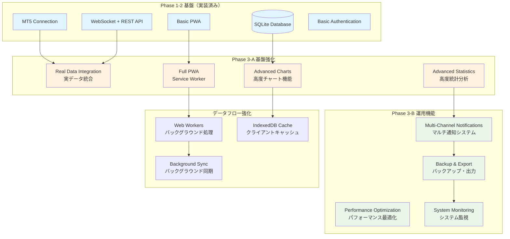

# JamesORB監視ダッシュボード Phase 3基盤強化設計書 v1.0

**作成日時**: 2025年7月28日 01:00 JST  
**作成者**: Kiro AI IDE  
**対象**: JamesORBデモ取引監視ダッシュボード Phase 3  
**目的**: 基盤強化・運用機能拡張・エンタープライズ級品質実現

## システム基盤強化アーキテクチャ

### Phase 3 拡張システム構成図

## Phase 3-A: 基盤強化設計

### 1. データベース実データ統合設計

#### 拡張データベーススキーマ