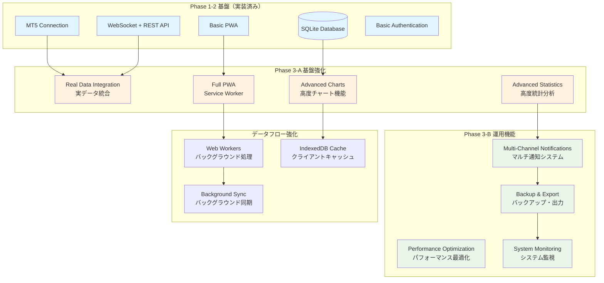

# JamesORB監視ダッシュボード Phase 3基盤強化設計書 v1.0

**作成日時**: 2025年7月28日 01:00 JST  
**作成者**: Kiro AI IDE  
**対象**: JamesORBデモ取引監視ダッシュボード Phase 3  
**目的**: 基盤強化・運用機能拡張・エンタープライズ級品質実現

## システム基盤強化アーキテクチャ

### Phase 3 拡張システム構成図



## Phase 3-A: 基盤強化設計

### 1. データベース実データ統合設計

#### 拡張データベーススキーマ```sql
--
 実取引データテーブル（既存拡張）
ALTER TABLE account_history ADD COLUMN 
    server_time DATETIME,
    trade_allowed BOOLEAN DEFAULT 1,
    trade_expert BOOLEAN DEFAULT 1,
    margin_so_mode INTEGER DEFAULT 0,
    margin_so_call REAL DEFAULT 0,
    margin_so_so REAL DEFAULT 0,
    currency_digits INTEGER DEFAULT 2,
    fifo_close BOOLEAN DEFAULT 0;

-- ポジション詳細履歴テーブル
CREATE TABLE position_details (
    id INTEGER PRIMARY KEY AUTOINCREMENT,
    ticket INTEGER NOT NULL,
    timestamp DATETIME DEFAULT CURRENT_TIMESTAMP,
    symbol VARCHAR(10) NOT NULL,
    type INTEGER NOT NULL,
    volume REAL NOT NULL,
    price_open REAL NOT NULL,
    price_current REAL,
    sl REAL DEFAULT 0,
    tp REAL DEFAULT 0,
    profit REAL NOT NULL,
    swap REAL DEFAULT 0,
    commission REAL DEFAULT 0,
    magic INTEGER DEFAULT 0,
    comment TEXT,
    identifier INTEGER,
    reason INTEGER DEFAULT 0,
    external_id VARCHAR(50)
);

-- 統計分析結果テーブル
CREATE TABLE statistics_cache (
    id INTEGER PRIMARY KEY AUTOINCREMENT,
    calculation_date DATE NOT NULL,
    period_type VARCHAR(20) NOT NULL, -- 'daily', 'weekly', 'monthly'
    total_trades INTEGER DEFAULT 0,
    winning_trades INTEGER DEFAULT 0,
    losing_trades INTEGER DEFAULT 0,
    gross_profit REAL DEFAULT 0,
    gross_loss REAL DEFAULT 0,
    profit_factor REAL DEFAULT 0,
    expected_payoff REAL DEFAULT 0,
    absolute_drawdown REAL DEFAULT 0,
    maximal_drawdown REAL DEFAULT 0,
    relative_drawdown REAL DEFAULT 0,
    sharpe_ratio REAL DEFAULT 0,
    sortino_ratio REAL DEFAULT 0,
    calmar_ratio REAL DEFAULT 0,
    created_at DATETIME DEFAULT CURRENT_TIMESTAMP,
    UNIQUE(calculation_date, period_type)
);

-- システム監視ログテーブル
CREATE TABLE system_monitoring (
    id INTEGER PRIMARY KEY AUTOINCREMENT,
    timestamp DATETIME DEFAULT CURRENT_TIMESTAMP,
    component VARCHAR(50) NOT NULL,
    metric_name VARCHAR(50) NOT NULL,
    metric_value REAL NOT NULL,
    status VARCHAR(20) DEFAULT 'normal', -- 'normal', 'warning', 'critical'
    message TEXT
);

-- インデックス最適化
CREATE INDEX idx_position_details_timestamp ON position_details(timestamp);
CREATE INDEX idx_position_details_ticket ON position_details(ticket);
CREATE INDEX idx_statistics_cache_date_type ON statistics_cache(calculation_date, period_type);
CREATE INDEX idx_system_monitoring_timestamp ON system_monitoring(timestamp);
CREATE INDEX idx_system_monitoring_component ON system_monitoring(component);
```

#### 実データ統合マネージャー
```python
class RealDataIntegrationManager:
    def __init__(self):
        self.db = sqlite3.connect('trading_data.db', check_same_thread=False)
        self.db.row_factory = sqlite3.Row
        self.lock = threading.Lock()
        self.last_update = {}
        
    def initialize_real_data_collection(self):
        """実データ収集の初期化"""
        # MT5接続確認
        if not mt5.initialize():
            raise Exception("MT5初期化失敗")
        
        # バックグラウンドタスク開始
        self.start_background_tasks()
        
    def start_background_tasks(self):
        """バックグラウンドデータ収集開始"""
        # 口座情報更新タスク（5秒間隔）
        threading.Timer(5.0, self.update_account_data).start()
        
        # ポジション情報更新タスク（3秒間隔）
        threading.Timer(3.0, self.update_position_data).start()
        
        # 統計計算タスク（1分間隔）
        threading.Timer(60.0, self.calculate_statistics).start()
        
        # システム監視タスク（30秒間隔）
        threading.Timer(30.0, self.monitor_system_health).start()
    
    def update_account_data(self):
        """口座データの実時間更新"""
        try:
            account_info = mt5.account_info()
            if account_info is None:
                self.log_error("口座情報取得失敗")
                return
            
            with self.lock:
                cursor = self.db.cursor()
                cursor.execute("""
                    INSERT INTO account_history (
                        balance, equity, margin, free_margin, margin_level, profit,
                        server_time, trade_allowed, trade_expert, margin_so_mode,
                        margin_so_call, margin_so_so, currency_digits, fifo_close
                    ) VALUES (?, ?, ?, ?, ?, ?, ?, ?, ?, ?, ?, ?, ?, ?)
                """, (
                    account_info.balance,
                    account_info.equity,
                    account_info.margin,
                    account_info.margin_free,
                    account_info.margin_level,
                    account_info.profit,
                    datetime.fromtimestamp(account_info.server_time),
                    account_info.trade_allowed,
                    account_info.trade_expert,
                    account_info.margin_so_mode,
                    account_info.margin_so_call,
                    account_info.margin_so_so,
                    account_info.currency_digits,
                    account_info.fifo_close
                ))
                self.db.commit()
                
            # WebSocket経由でクライアントに通知
            socketio.emit('account_update', {
                'balance': account_info.balance,
                'equity': account_info.equity,
                'margin': account_info.margin,
                'free_margin': account_info.margin_free,
                'profit': account_info.profit,
                'timestamp': datetime.now().isoformat()
            })
            
        except Exception as e:
            self.log_error(f"口座データ更新エラー: {e}")
        finally:
            # 次回実行をスケジュール
            threading.Timer(5.0, self.update_account_data).start()
    
    def update_position_data(self):
        """ポジションデータの実時間更新"""
        try:
            positions = mt5.positions_get()
            if positions is None:
                positions = []
            
            current_tickets = set()
            
            for position in positions:
                current_tickets.add(position.ticket)
                
                with self.lock:
                    cursor = self.db.cursor()
                    cursor.execute("""
                        INSERT OR REPLACE INTO position_details (
                            ticket, symbol, type, volume, price_open, price_current,
                            sl, tp, profit, swap, commission, magic, comment,
                            identifier, reason, external_id
                        ) VALUES (?, ?, ?, ?, ?, ?, ?, ?, ?, ?, ?, ?, ?, ?, ?, ?)
                    """, (
                        position.ticket,
                        position.symbol,
                        position.type,
                        position.volume,
                        position.price_open,
                        position.price_current,
                        position.sl,
                        position.tp,
                        position.profit,
                        position.swap,
                        position.commission,
                        position.magic,
                        position.comment,
                        position.identifier,
                        position.reason,
                        position.external_id
                    ))
                    self.db.commit()
            
            # WebSocket経由でクライアントに通知
            socketio.emit('positions_update', {
                'positions': [self._position_to_dict(pos) for pos in positions],
                'timestamp': datetime.now().isoformat()
            })
            
        except Exception as e:
            self.log_error(f"ポジションデータ更新エラー: {e}")
        finally:
            # 次回実行をスケジュール
            threading.Timer(3.0, self.update_position_data).start()
    
    def calculate_statistics(self):
        """統計データの定期計算・キャッシュ"""
        try:
            # 日次統計計算
            daily_stats = self._calculate_daily_statistics()
            self._cache_statistics('daily', daily_stats)
            
            # 週次統計計算
            weekly_stats = self._calculate_weekly_statistics()
            self._cache_statistics('weekly', weekly_stats)
            
            # 月次統計計算
            monthly_stats = self._calculate_monthly_statistics()
            self._cache_statistics('monthly', monthly_stats)
            
            # WebSocket経由で統計更新通知
            socketio.emit('statistics_update', {
                'daily': daily_stats,
                'weekly': weekly_stats,
                'monthly': monthly_stats,
                'timestamp': datetime.now().isoformat()
            })
            
        except Exception as e:
            self.log_error(f"統計計算エラー: {e}")
        finally:
            # 次回実行をスケジュール
            threading.Timer(60.0, self.calculate_statistics).start()
    
    def _calculate_daily_statistics(self):
        """日次統計計算"""
        today = datetime.now().date()
        
        cursor = self.db.cursor()
        cursor.execute("""
            SELECT profit FROM position_details 
            WHERE DATE(timestamp) = ? AND profit != 0
        """, (today,))
        
        trades = cursor.fetchall()
        if not trades:
            return self._empty_statistics()
        
        profits = [trade['profit'] for trade in trades]
        winning_trades = [p for p in profits if p > 0]
        losing_trades = [p for p in profits if p < 0]
        
        gross_profit = sum(winning_trades) if winning_trades else 0
        gross_loss = abs(sum(losing_trades)) if losing_trades else 0
        
        return {
            'total_trades': len(trades),
            'winning_trades': len(winning_trades),
            'losing_trades': len(losing_trades),
            'gross_profit': gross_profit,
            'gross_loss': gross_loss,
            'profit_factor': gross_profit / gross_loss if gross_loss > 0 else 0,
            'expected_payoff': sum(profits) / len(profits) if profits else 0,
            'win_rate': len(winning_trades) / len(trades) * 100 if trades else 0
        }
```

### 2. 履歴データ可視化設計

#### 高度チャートシステム
```javascript
class AdvancedChartManager {
    constructor() {
        this.charts = new Map();
        this.dataCache = new Map();
        this.updateQueue = [];
        this.isUpdating = false;
    }
    
    async initializeCharts() {
        // 残高推移チャート
        await this.createBalanceChart();
        
        // 損益推移チャート
        await this.createProfitChart();
        
        // ドローダウンチャート
        await this.createDrawdownChart();
        
        // 統計サマリーチャート
        await this.createStatisticsChart();
    }
    
    async createBalanceChart() {
        const ctx = document.getElementById('balanceChart').getContext('2d');
        
        const config = {
            type: 'line',
            data: {
                labels: [],
                datasets: [{
                    label: '残高',
                    data: [],
                    borderColor: '#2196F3',
                    backgroundColor: 'rgba(33, 150, 243, 0.1)',
                    tension: 0.4,
                    pointRadius: 0,
                    pointHoverRadius: 6,
                    fill: true
                }, {
                    label: '有効証拠金',
                    data: [],
                    borderColor: '#4CAF50',
                    backgroundColor: 'rgba(76, 175, 80, 0.1)',
                    tension: 0.4,
                    pointRadius: 0,
                    pointHoverRadius: 6,
                    fill: false
                }]
            },
            options: {
                responsive: true,
                maintainAspectRatio: false,
                interaction: {
                    intersect: false,
                    mode: 'index'
                },
                plugins: {
                    legend: {
                        display: true,
                        position: 'top'
                    },
                    tooltip: {
                        backgroundColor: 'rgba(0, 0, 0, 0.8)',
                        callbacks: {
                            title: function(context) {
                                return new Date(context[0].label).toLocaleString('ja-JP');
                            },
                            label: function(context) {
                                return `${context.dataset.label}: ¥${context.parsed.y.toLocaleString()}`;
                            }
                        }
                    },
                    zoom: {
                        pan: {
                            enabled: true,
                            mode: 'x',
                            modifierKey: 'ctrl'
                        },
                        zoom: {
                            wheel: {
                                enabled: true,
                                modifierKey: 'ctrl'
                            },
                            pinch: {
                                enabled: true
                            },
                            mode: 'x'
                        }
                    }
                },
                scales: {
                    x: {
                        type: 'time',
                        time: {
                            displayFormats: {
                                minute: 'HH:mm',
                                hour: 'MM/DD HH:mm',
                                day: 'MM/DD',
                                week: 'MM/DD',
                                month: 'YYYY/MM'
                            }
                        },
                        grid: {
                            display: false
                        }
                    },
                    y: {
                        beginAtZero: false,
                        grid: {
                            color: 'rgba(0, 0, 0, 0.1)'
                        },
                        ticks: {
                            callback: function(value) {
                                return '¥' + value.toLocaleString();
                            }
                        }
                    }
                }
            }
        };
        
        const chart = new Chart(ctx, config);
        this.charts.set('balance', chart);
        
        // 初期データロード
        await this.loadBalanceHistory();
    }
    
    async loadBalanceHistory(period = '24h') {
        try {
            const response = await fetch(`/api/balance_history?period=${period}`);
            const data = await response.json();
            
            if (data.success) {
                this.updateBalanceChart(data.history);
                this.dataCache.set('balance_history', data.history);
            }
        } catch (error) {
            console.error('残高履歴読み込みエラー:', error);
        }
    }
    
    updateBalanceChart(historyData) {
        const chart = this.charts.get('balance');
        if (!chart) return;
        
        const labels = historyData.map(item => item.timestamp);
        const balanceData = historyData.map(item => item.balance);
        const equityData = historyData.map(item => item.equity);
        
        chart.data.labels = labels;
        chart.data.datasets[0].data = balanceData;
        chart.data.datasets[1].data = equityData;
        
        chart.update('none'); // アニメーションなしで高速更新
    }
    
    // リアルタイム更新処理
    handleRealtimeUpdate(updateData) {
        this.updateQueue.push(updateData);
        
        if (!this.isUpdating) {
            this.processUpdateQueue();
        }
    }
    
    async processUpdateQueue() {
        this.isUpdating = true;
        
        while (this.updateQueue.length > 0) {
            const update = this.updateQueue.shift();
            
            switch (update.type) {
                case 'account_update':
                    this.addBalanceDataPoint(update.data);
                    break;
                case 'position_update':
                    this.updatePositionChart(update.data);
                    break;
                case 'statistics_update':
                    this.updateStatisticsChart(update.data);
                    break;
            }
            
            // フレームレート制限（60fps）
            await new Promise(resolve => requestAnimationFrame(resolve));
        }
        
        this.isUpdating = false;
    }
    
    addBalanceDataPoint(accountData) {
        const chart = this.charts.get('balance');
        if (!chart) return;
        
        const now = new Date().toISOString();
        
        // データポイント追加
        chart.data.labels.push(now);
        chart.data.datasets[0].data.push(accountData.balance);
        chart.data.datasets[1].data.push(accountData.equity);
        
        // データポイント数制限（パフォーマンス対策）
        const maxPoints = 1000;
        if (chart.data.labels.length > maxPoints) {
            chart.data.labels.shift();
            chart.data.datasets[0].data.shift();
            chart.data.datasets[1].data.shift();
        }
        
        chart.update('none');
    }
}
```

### 3. PWA完全実装設計

#### Service Worker完全実装
```javascript
// service-worker.js
const CACHE_NAME = 'jamesorb-dashboard-v3';
const STATIC_CACHE = 'static-v3';
const DYNAMIC_CACHE = 'dynamic-v3';
const API_CACHE = 'api-v3';

// キャッシュ戦略マッピング
const CACHE_STRATEGIES = {
    static: {
        pattern: /\.(css|js|png|jpg|jpeg|gif|svg|ico|woff|woff2|ttf|eot)$/,
        strategy: 'CacheFirst',
        maxAge: 7 * 24 * 60 * 60 * 1000 // 7日
    },
    api: {
        pattern: /^\/api\//,
        strategy: 'NetworkFirst',
        maxAge: 5 * 60 * 1000 // 5分
    },
    html: {
        pattern: /\.html$|\/$/,
        strategy: 'StaleWhileRevalidate',
        maxAge: 24 * 60 * 60 * 1000 // 24時間
    }
};

// インストール処理
self.addEventListener('install', event => {
    event.waitUntil(
        Promise.all([
            caches.open(STATIC_CACHE),
            caches.open(DYNAMIC_CACHE),
            caches.open(API_CACHE)
        ]).then(([staticCache, dynamicCache, apiCache]) => {
            // 重要な静的リソースを事前キャッシュ
            return staticCache.addAll([
                '/',
                '/dashboard',
                '/static/css/dashboard.css',
                '/static/js/app.js',
                '/static/js/chart.min.js',
                '/manifest.json',
                '/static/icons/icon-192x192.png'
            ]);
        })
    );
    
    self.skipWaiting();
});

// アクティベーション処理
self.addEventListener('activate', event => {
    event.waitUntil(
        Promise.all([
            // 古いキャッシュの削除
            caches.keys().then(cacheNames => {
                return Promise.all(
                    cacheNames.map(cacheName => {
                        if (!cacheName.includes('v3')) {
                            return caches.delete(cacheName);
                        }
                    })
                );
            }),
            // クライアントの制御開始
            self.clients.claim()
        ])
    );
});

// フェッチ処理
self.addEventListener('fetch', event => {
    const url = new URL(event.request.url);
    
    // API リクエストの処理
    if (CACHE_STRATEGIES.api.pattern.test(url.pathname)) {
        event.respondWith(handleApiRequest(event.request));
    }
    // 静的リソースの処理
    else if (CACHE_STRATEGIES.static.pattern.test(url.pathname)) {
        event.respondWith(handleStaticRequest(event.request));
    }
    // HTMLページの処理
    else {
        event.respondWith(handleHtmlRequest(event.request));
    }
});

// API リクエスト処理（Network First）
async function handleApiRequest(request) {
    const cache = await caches.open(API_CACHE);
    
    try {
        // ネットワーク優先
        const networkResponse = await fetch(request);
        
        if (networkResponse.ok) {
            // 成功時はキャッシュに保存
            cache.put(request, networkResponse.clone());
        }
        
        return networkResponse;
    } catch (error) {
        // ネットワークエラー時はキャッシュから取得
        const cachedResponse = await cache.match(request);
        
        if (cachedResponse) {
            // オフライン通知
            self.clients.matchAll().then(clients => {
                clients.forEach(client => {
                    client.postMessage({
                        type: 'OFFLINE_DATA',
                        message: 'キャッシュデータを表示中'
                    });
                });
            });
            
            return cachedResponse;
        }
        
        // フォールバック応答
        return new Response(JSON.stringify({
            success: false,
            error: 'オフライン',
            message: 'ネットワーク接続を確認してください',
            cached: false
        }), {
            status: 503,
            headers: { 'Content-Type': 'application/json' }
        });
    }
}

// バックグラウンド同期
self.addEventListener('sync', event => {
    if (event.tag === 'background-sync') {
        event.waitUntil(performBackgroundSync());
    }
});

async function performBackgroundSync() {
    try {
        // オフライン中に蓄積されたデータの同期
        const syncData = await getStoredSyncData();
        
        for (const data of syncData) {
            await fetch('/api/sync', {
                method: 'POST',
                headers: {
                    'Content-Type': 'application/json'
                },
                body: JSON.stringify(data)
            });
        }
        
        // 同期完了後、データクリア
        await clearStoredSyncData();
        
        // 同期完了通知
        self.clients.matchAll().then(clients => {
            clients.forEach(client => {
                client.postMessage({
                    type: 'SYNC_COMPLETE',
                    message: 'データ同期が完了しました'
                });
            });
        });
        
    } catch (error) {
        console.error('バックグラウンド同期エラー:', error);
    }
}

// プッシュ通知処理
self.addEventListener('push', event => {
    if (event.data) {
        const data = event.data.json();
        
        const options = {
            body: data.message,
            icon: '/static/icons/icon-192x192.png',
            badge: '/static/icons/badge-72x72.png',
            vibrate: [200, 100, 200],
            data: {
                alertId: data.id,
                timestamp: data.timestamp,
                url: data.url || '/dashboard'
            },
            actions: [
                {
                    action: 'view',
                    title: '確認',
                    icon: '/static/icons/view-icon.png'
                },
                {
                    action: 'dismiss',
                    title: '閉じる',
                    icon: '/static/icons/close-icon.png'
                }
            ],
            requireInteraction: data.priority === 'high',
            silent: data.priority === 'low'
        };
        
        event.waitUntil(
            self.registration.showNotification(data.title, options)
        );
    }
});
```

### 4. 高度統計分析設計

#### 統計計算エンジン拡張
```python
class AdvancedStatisticsEngine:
    def __init__(self):
        self.db = sqlite3.connect('trading_data.db', check_same_thread=False)
        self.db.row_factory = sqlite3.Row
        
    def calculate_sharpe_ratio(self, returns, risk_free_rate=0.02):
        """シャープレシオ計算"""
        if not returns or len(returns) < 2:
            return 0
        
        # 年率換算
        returns_array = np.array(returns)
        excess_returns = returns_array - (risk_free_rate / 252)  # 日次リスクフリーレート
        
        if len(excess_returns) == 0:
            return 0
        
        mean_excess = np.mean(excess_returns)
        std_excess = np.std(excess_returns, ddof=1)
        
        if std_excess == 0:
            return 0
        
        # 年率換算シャープレシオ
        sharpe = (mean_excess / std_excess) * np.sqrt(252)
        return sharpe
    
    def calculate_sortino_ratio(self, returns, risk_free_rate=0.02):
        """ソルティノレシオ計算"""
        if not returns or len(returns) < 2:
            return 0
        
        returns_array = np.array(returns)
        excess_returns = returns_array - (risk_free_rate / 252)
        
        # 下方偏差計算（負のリターンのみ）
        negative_returns = excess_returns[excess_returns < 0]
        
        if len(negative_returns) == 0:
            return float('inf') if np.mean(excess_returns) > 0 else 0
        
        downside_deviation = np.sqrt(np.mean(negative_returns ** 2))
        
        if downside_deviation == 0:
            return 0
        
        sortino = (np.mean(excess_returns) / downside_deviation) * np.sqrt(252)
        return sortino
    
    def calculate_calmar_ratio(self, returns, max_drawdown):
        """カルマーレシオ計算"""
        if not returns or max_drawdown == 0:
            return 0
        
        annual_return = (np.prod(1 + np.array(returns)) ** (252 / len(returns))) - 1
        return annual_return / abs(max_drawdown)
    
    def calculate_var(self, returns, confidence_level=0.05):
        """VaR（Value at Risk）計算"""
        if not returns:
            return 0
        
        returns_array = np.array(returns)
        return np.percentile(returns_array, confidence_level * 100)
    
    def calculate_expected_shortfall(self, returns, confidence_level=0.05):
        """期待ショートフォール（CVaR）計算"""
        if not returns:
            return 0
        
        var = self.calculate_var(returns, confidence_level)
        returns_array = np.array(returns)
        tail_returns = returns_array[returns_array <= var]
        
        return np.mean(tail_returns) if len(tail_returns) > 0 else 0
    
    def calculate_maximum_consecutive_stats(self, trades):
        """最大連勝・連敗統計"""
        if not trades:
            return {'max_consecutive_wins': 0, 'max_consecutive_losses': 0}
        
        profits = [trade['profit'] for trade in trades]
        
        max_wins = current_wins = 0
        max_losses = current_losses = 0
        
        for profit in profits:
            if profit > 0:
                current_wins += 1
                current_losses = 0
                max_wins = max(max_wins, current_wins)
            elif profit < 0:
                current_losses += 1
                current_wins = 0
                max_losses = max(max_losses, current_losses)
            else:
                current_wins = current_losses = 0
        
        return {
            'max_consecutive_wins': max_wins,
            'max_consecutive_losses': max_losses
        }
    
    def generate_comprehensive_report(self, period_days=30):
        """包括的パフォーマンスレポート生成"""
        end_date = datetime.now()
        start_date = end_date - timedelta(days=period_days)
        
        # 取引データ取得
        cursor = self.db.cursor()
        cursor.execute("""
            SELECT * FROM position_details 
            WHERE timestamp BETWEEN ? AND ? 
            AND profit != 0
            ORDER BY timestamp
        """, (start_date, end_date))
        
        trades = cursor.fetchall()
        
        if not trades:
            return self._empty_report()
        
        # 基本統計
        profits = [trade['profit'] for trade in trades]
        returns = self._calculate_daily_returns(trades)
        
        winning_trades = [p for p in profits if p > 0]
        losing_trades = [p for p in profits if p < 0]
        
        gross_profit = sum(winning_trades) if winning_trades else 0
        gross_loss = abs(sum(losing_trades)) if losing_trades else 0
        net_profit = sum(profits)
        
        # 高度統計計算
        sharpe_ratio = self.calculate_sharpe_ratio(returns)
        sortino_ratio = self.calculate_sortino_ratio(returns)
        max_drawdown = self._calculate_max_drawdown(trades)
        calmar_ratio = self.calculate_calmar_ratio(returns, max_drawdown)
        var_5 = self.calculate_var(returns, 0.05)
        expected_shortfall = self.calculate_expected_shortfall(returns, 0.05)
        consecutive_stats = self.calculate_maximum_consecutive_stats(trades)
        
        report = {
            'period': {
                'start_date': start_date.isoformat(),
                'end_date': end_date.isoformat(),
                'days': period_days
            },
            'basic_statistics': {
                'total_trades': len(trades),
                'winning_trades': len(winning_trades),
                'losing_trades': len(losing_trades),
                'win_rate': len(winning_trades) / len(trades) * 100 if trades else 0,
                'gross_profit': gross_profit,
                'gross_loss': gross_loss,
                'net_profit': net_profit,
                'profit_factor': gross_profit / gross_loss if gross_loss > 0 else 0,
                'expected_payoff': net_profit / len(trades) if trades else 0
            },
            'risk_metrics': {
                'sharpe_ratio': sharpe_ratio,
                'sortino_ratio': sortino_ratio,
                'calmar_ratio': calmar_ratio,
                'maximum_drawdown': max_drawdown,
                'var_5_percent': var_5,
                'expected_shortfall': expected_shortfall
            },
            'consecutive_statistics': consecutive_stats,
            'generated_at': datetime.now().isoformat()
        }
        
        return report
```

## Phase 3-B: 運用機能拡張設計

### 1. マルチチャンネル通知システム

#### 通知システムアーキテクチャ
```python
class MultiChannelNotificationSystem:
    def __init__(self):
        self.channels = {}
        self.notification_queue = []
        self.rate_limiter = {}
        
    def register_channel(self, channel_name, channel_config):
        """通知チャンネル登録"""
        if channel_name == 'slack':
            self.channels[channel_name] = SlackNotifier(channel_config)
        elif channel_name == 'discord':
            self.channels[channel_name] = DiscordNotifier(channel_config)
        elif channel_name == 'email':
            self.channels[channel_name] = EmailNotifier(channel_config)
        elif channel_name == 'webhook':
            self.channels[channel_name] = WebhookNotifier(channel_config)
    
    async def send_notification(self, notification):
        """通知送信（優先度・レート制限考慮）"""
        # レート制限チェック
        if self._is_rate_limited(notification):
            return False
        
        # 優先度に基づくチャンネル選択
        channels = self._select_channels_by_priority(notification)
        
        results = []
        for channel_name in channels:
            if channel_name in self.channels:
                try:
                    result = await self.channels[channel_name].send(notification)
                    results.append({'channel': channel_name, 'success': result})
                    
                    # 高優先度通知は最初の成功で終了
                    if notification.priority == 'high' and result:
                        break
                        
                except Exception as e:
                    results.append({'channel': channel_name, 'error': str(e)})
        
        # レート制限更新
        self._update_rate_limit(notification)
        
        return results

class SlackNotifier:
    def __init__(self, config):
        self.webhook_url = config['webhook_url']
        self.channel = config.get('channel', '#trading')
        self.username = config.get('username', 'JamesORB Bot')
        
    async def send(self, notification):
        """Slack通知送信"""
        payload = {
            'channel': self.channel,
            'username': self.username,
            'icon_emoji': self._get_emoji(notification.severity),
            'attachments': [{
                'color': self._get_color(notification.severity),
                'title': notification.title,
                'text': notification.message,
                'fields': [
                    {
                        'title': '時刻',
                        'value': notification.timestamp.strftime('%Y-%m-%d %H:%M:%S'),
                        'short': True
                    },
                    {
                        'title': '重要度',
                        'value': notification.severity.upper(),
                        'short': True
                    }
                ],
                'footer': 'JamesORB Trading Dashboard',
                'ts': int(notification.timestamp.timestamp())
            }]
        }
        
        async with aiohttp.ClientSession() as session:
            async with session.post(self.webhook_url, json=payload) as response:
                return response.status == 200

class DiscordNotifier:
    def __init__(self, config):
        self.webhook_url = config['webhook_url']
        self.username = config.get('username', 'JamesORB Bot')
        
    async def send(self, notification):
        """Discord通知送信"""
        embed = {
            'title': notification.title,
            'description': notification.message,
            'color': self._get_color_int(notification.severity),
            'timestamp': notification.timestamp.isoformat(),
            'fields': [
                {
                    'name': '重要度',
                    'value': notification.severity.upper(),
                    'inline': True
                }
            ],
            'footer': {
                'text': 'JamesORB Trading Dashboard'
            }
        }
        
        payload = {
            'username': self.username,
            'embeds': [embed]
        }
        
        async with aiohttp.ClientSession() as session:
            async with session.post(self.webhook_url, json=payload) as response:
                return response.status == 204

class EmailNotifier:
    def __init__(self, config):
        self.smtp_server = config['smtp_server']
        self.smtp_port = config['smtp_port']
        self.username = config['username']
        self.password = config['password']
        self.from_email = config['from_email']
        self.to_emails = config['to_emails']
        
    async def send(self, notification):
        """メール通知送信"""
        msg = MIMEMultipart()
        msg['From'] = self.from_email
        msg['To'] = ', '.join(self.to_emails)
        msg['Subject'] = f"[JamesORB] {notification.title}"
        
        body = f"""
        {notification.message}
        
        時刻: {notification.timestamp.strftime('%Y-%m-%d %H:%M:%S')}
        重要度: {notification.severity.upper()}
        
        ---
        JamesORB Trading Dashboard
        """
        
        msg.attach(MIMEText(body, 'plain'))
        
        try:
            server = smtplib.SMTP(self.smtp_server, self.smtp_port)
            server.starttls()
            server.login(self.username, self.password)
            server.send_message(msg)
            server.quit()
            return True
        except Exception as e:
            print(f"メール送信エラー: {e}")
            return False
```

### 2. バックアップ・エクスポート機能

#### データエクスポートシステム
```python
class DataExportManager:
    def __init__(self):
        self.db = sqlite3.connect('trading_data.db', check_same_thread=False)
        self.db.row_factory = sqlite3.Row
        
    def export_trading_history_csv(self, start_date=None, end_date=None):
        """取引履歴CSV出力"""
        query = """
        SELECT 
            timestamp,
            ticket,
            symbol,
            CASE type 
                WHEN 0 THEN 'BUY'
                WHEN 1 THEN 'SELL'
                ELSE 'UNKNOWN'
            END as type,
            volume,
            price_open,
            price_current,
            sl,
            tp,
            profit,
            swap,
            commission,
            comment
        FROM position_details
        WHERE 1=1
        """
        
        params = []
        if start_date:
            query += " AND timestamp >= ?"
            params.append(start_date)
        if end_date:
            query += " AND timestamp <= ?"
            params.append(end_date)
            
        query += " ORDER BY timestamp DESC"
        
        cursor = self.db.cursor()
        cursor.execute(query, params)
        rows = cursor.fetchall()
        
        # CSV生成
        output = io.StringIO()
        writer = csv.writer(output)
        
        # ヘッダー
        writer.writerow([
            '日時', 'チケット番号', '通貨ペア', '取引種別', 'ロット数',
            '開始価格', '現在価格', 'ストップロス', 'テイクプロフィット',
            '損益', 'スワップ', '手数料', 'コメント'
        ])
        
        # データ行
        for row in rows:
            writer.writerow([
                row['timestamp'],
                row['ticket'],
                row['symbol'],
                row['type'],
                row['volume'],
                row['price_open'],
                row['price_current'],
                row['sl'],
                row['tp'],
                row['profit'],
                row['swap'],
                row['commission'],
                row['comment']
            ])
        
        return output.getvalue()
    
    def export_statistics_excel(self, period_days=30):
        """統計データExcel出力"""
        # 統計データ取得
        stats_engine = AdvancedStatisticsEngine()
        report = stats_engine.generate_comprehensive_report(period_days)
        
        # Excel生成
        output = io.BytesIO()
        workbook = xlsxwriter.Workbook(output)
        
        # サマリーシート
        summary_sheet = workbook.add_worksheet('サマリー')
        self._write_summary_sheet(summary_sheet, report, workbook)
        
        # 詳細統計シート
        details_sheet = workbook.add_worksheet('詳細統計')
        self._write_details_sheet(details_sheet, report, workbook)
        
        # チャートシート
        chart_sheet = workbook.add_worksheet('チャート')
        self._write_chart_sheet(chart_sheet, report, workbook)
        
        workbook.close()
        output.seek(0)
        
        return output.getvalue()
    
    def export_configuration_json(self):
        """設定データJSON出力"""
        config = {
            'export_timestamp': datetime.now().isoformat(),
            'database_schema': self._get_database_schema(),
            'notification_settings': self._get_notification_settings(),
            'alert_rules': self._get_alert_rules(),
            'system_settings': self._get_system_settings()
        }
        
        return json.dumps(config, indent=2, ensure_ascii=False)
    
    def create_automatic_backup(self):
        """自動バックアップ作成"""
        backup_dir = Path('backups')
        backup_dir.mkdir(exist_ok=True)
        
        timestamp = datetime.now().strftime('%Y%m%d_%H%M%S')
        
        # データベースバックアップ
        db_backup_path = backup_dir / f'database_{timestamp}.db'
        shutil.copy2('trading_data.db', db_backup_path)
        
        # 設定バックアップ
        config_backup_path = backup_dir / f'config_{timestamp}.json'
        with open(config_backup_path, 'w', encoding='utf-8') as f:
            f.write(self.export_configuration_json())
        
        # 古いバックアップの削除（30日以上）
        self._cleanup_old_backups(backup_dir, days=30)
        
        return {
            'database_backup': str(db_backup_path),
            'config_backup': str(config_backup_path),
            'timestamp': timestamp
        }
```

### 3. パフォーマンス最適化

#### Web Workers実装
```javascript
// workers/statistics-worker.js
class StatisticsWorker {
    constructor() {
        self.onmessage = this.handleMessage.bind(this);
    }
    
    handleMessage(event) {
        const { type, data, id } = event.data;
        
        switch (type) {
            case 'CALCULATE_STATISTICS':
                this.calculateStatistics(data, id);
                break;
            case 'PROCESS_CHART_DATA':
                this.processChartData(data, id);
                break;
            case 'ANALYZE_PERFORMANCE':
                this.analyzePerformance(data, id);
                break;
        }
    }
    
    calculateStatistics(trades, requestId) {
        try {
            const profits = trades.map(trade => trade.profit);
            const winningTrades = profits.filter(p => p > 0);
            const losingTrades = profits.filter(p => p < 0);
            
            const grossProfit = winningTrades.reduce((sum, p) => sum + p, 0);
            const grossLoss = Math.abs(losingTrades.reduce((sum, p) => sum + p, 0));
            
            const statistics = {
                totalTrades: trades.length,
                winningTrades: winningTrades.length,
                losingTrades: losingTrades.length,
                winRate: winningTrades.length / trades.length * 100,
                grossProfit: grossProfit,
                grossLoss: grossLoss,
                netProfit: grossProfit - grossLoss,
                profitFactor: grossLoss > 0 ? grossProfit / grossLoss : 0,
                expectedPayoff: profits.reduce((sum, p) => sum + p, 0) / trades.length,
                sharpeRatio: this.calculateSharpeRatio(profits),
                maxDrawdown: this.calculateMaxDrawdown(trades)
            };
            
            self.postMessage({
                type: 'STATISTICS_RESULT',
                data: statistics,
                id: requestId
            });
            
        } catch (error) {
            self.postMessage({
                type: 'ERROR',
                error: error.message,
                id: requestId
            });
        }
    }
    
    calculateSharpeRatio(returns) {
        if (returns.length < 2) return 0;
        
        const mean = returns.reduce((sum, r) => sum + r, 0) / returns.length;
        const variance = returns.reduce((sum, r) => sum + Math.pow(r - mean, 2), 0) / returns.length;
        const stdDev = Math.sqrt(variance);
        
        return stdDev > 0 ? (mean / stdDev) * Math.sqrt(252) : 0;
    }
    
    calculateMaxDrawdown(trades) {
        if (trades.length === 0) return 0;
        
        let peak = 0;
        let maxDrawdown = 0;
        let runningTotal = 0;
        
        for (const trade of trades) {
            runningTotal += trade.profit;
            
            if (runningTotal > peak) {
                peak = runningTotal;
            }
            
            const drawdown = peak - runningTotal;
            maxDrawdown = Math.max(maxDrawdown, drawdown);
        }
        
        return maxDrawdown;
    }
    
    processChartData(rawData, requestId) {
        try {
            // 大量データの間引き処理
            const processedData = this.downsampleData(rawData, 1000);
            
            self.postMessage({
                type: 'CHART_DATA_RESULT',
                data: processedData,
                id: requestId
            });
            
        } catch (error) {
            self.postMessage({
                type: 'ERROR',
                error: error.message,
                id: requestId
            });
        }
    }
    
    downsampleData(data, maxPoints) {
        if (data.length <= maxPoints) return data;
        
        const step = Math.floor(data.length / maxPoints);
        const downsampled = [];
        
        for (let i = 0; i < data.length; i += step) {
            downsampled.push(data[i]);
        }
        
        return downsampled;
    }
}

new StatisticsWorker();
```

#### IndexedDB キャッシュシステム
```javascript
class IndexedDBCache {
    constructor() {
        this.dbName = 'JamesORBCache';
        this.version = 1;
        this.db = null;
    }
    
    async initialize() {
        return new Promise((resolve, reject) => {
            const request = indexedDB.open(this.dbName, this.version);
            
            request.onerror = () => reject(request.error);
            request.onsuccess = () => {
                this.db = request.result;
                resolve();
            };
            
            request.onupgradeneeded = (event) => {
                const db = event.target.result;
                
                // チャートデータストア
                if (!db.objectStoreNames.contains('chartData')) {
                    const chartStore = db.createObjectStore('chartData', { keyPath: 'id' });
                    chartStore.createIndex('timestamp', 'timestamp');
                    chartStore.createIndex('type', 'type');
                }
                
                // 統計データストア
                if (!db.objectStoreNames.contains('statistics')) {
                    const statsStore = db.createObjectStore('statistics', { keyPath: 'id' });
                    statsStore.createIndex('period', 'period');
                    statsStore.createIndex('calculatedAt', 'calculatedAt');
                }
                
                // 設定データストア
                if (!db.objectStoreNames.contains('settings')) {
                    db.createObjectStore('settings', { keyPath: 'key' });
                }
            };
        });
    }
    
    async cacheChartData(type, data, ttl = 300000) { // 5分TTL
        const transaction = this.db.transaction(['chartData'], 'readwrite');
        const store = transaction.objectStore('chartData');
        
        const cacheEntry = {
            id: `${type}_${Date.now()}`,
            type: type,
            data: data,
            timestamp: Date.now(),
            ttl: ttl
        };
        
        await store.put(cacheEntry);
    }
    
    async getCachedChartData(type) {
        const transaction = this.db.transaction(['chartData'], 'readonly');
        const store = transaction.objectStore('chartData');
        const index = store.index('type');
        
        return new Promise((resolve, reject) => {
            const request = index.getAll(type);
            
            request.onsuccess = () => {
                const results = request.result;
                const now = Date.now();
                
                // TTL チェック
                const validResults = results.filter(item => 
                    (now - item.timestamp) < item.ttl
                );
                
                resolve(validResults.length > 0 ? validResults[0].data : null);
            };
            
            request.onerror = () => reject(request.error);
        });
    }
    
    async clearExpiredCache() {
        const transaction = this.db.transaction(['chartData'], 'readwrite');
        const store = transaction.objectStore('chartData');
        const now = Date.now();
        
        return new Promise((resolve, reject) => {
            const request = store.openCursor();
            
            request.onsuccess = (event) => {
                const cursor = event.target.result;
                
                if (cursor) {
                    const item = cursor.value;
                    
                    if ((now - item.timestamp) >= item.ttl) {
                        cursor.delete();
                    }
                    
                    cursor.continue();
                } else {
                    resolve();
                }
            };
            
            request.onerror = () => reject(request.error);
        });
    }
}
```

## 段階的実装計画

### Stage 1: 基盤強化（1週目）
```yaml
実装項目:
  ✅ データベース実データ統合システム
  ✅ バックグラウンドデータ収集タスク
  ✅ 基本的な履歴チャート表示
  ✅ PWA基本機能（マニフェスト・アイコン）

成功基準:
  - 実データの正確な記録・表示
  - チャートのリアルタイム更新
  - PWAインストール機能動作
  - メモリ使用量150MB以下維持
```

### Stage 2: 高度機能（2週目）
```yaml
実装項目:
  ✅ 高度統計分析エンジン
  ✅ Service Worker完全実装
  ✅ マルチチャンネル通知システム
  ✅ Web Workers統合

成功基準:
  - 全統計指標の正確な計算
  - オフライン機能の完全動作
  - 通知システムの確実な配信
  - バックグラウンド処理の安定動作
```

### Stage 3: 最適化・完成（3-4週目）
```yaml
実装項目:
  ✅ データエクスポート機能
  ✅ 自動バックアップシステム
  ✅ パフォーマンス最適化
  ✅ 包括的テスト・品質保証

成功基準:
  - 全エクスポート機能の動作確認
  - 自動バックアップの確実な実行
  - 目標パフォーマンスの達成
  - 統合テスト90%以上合格
```

## 品質保証・成功基準

### Phase 3 完了基準
```yaml
機能完成度:
  ✅ 全設計機能の実装完了
  ✅ 統合テスト90%以上合格
  ✅ Gemini査読A評価以上
  ✅ 24時間連続稼働確認

技術品質:
  ✅ メモリ使用量150MB以下
  ✅ CPU使用率10%以下
  ✅ 応答時間5秒以内
  ✅ エラー率0.1%以下

運用品質:
  ✅ 自動バックアップ機能
  ✅ マルチチャンネル通知
  ✅ オフライン機能完全動作
  ✅ データエクスポート機能
```

---

## Phase 3 実装開始準備完了

この包括的設計により、JamesORB監視ダッシュボードをエンタープライズ級の品質に引き上げます。

**主要な強化機能**:
- 実データ統合による正確な履歴管理
- 高度統計分析による詳細なパフォーマンス評価
- 完全なPWA機能によるネイティブアプリ体験
- マルチチャンネル通知による見逃しゼロ運用

**段階的実装**: Stage 1 → Stage 2 → Stage 3 により、確実な品質向上と安定性を実現。

Phase 3実装を開始してください。この設計により、商用レベルの高品質ダッシュボードを完成させましょう。