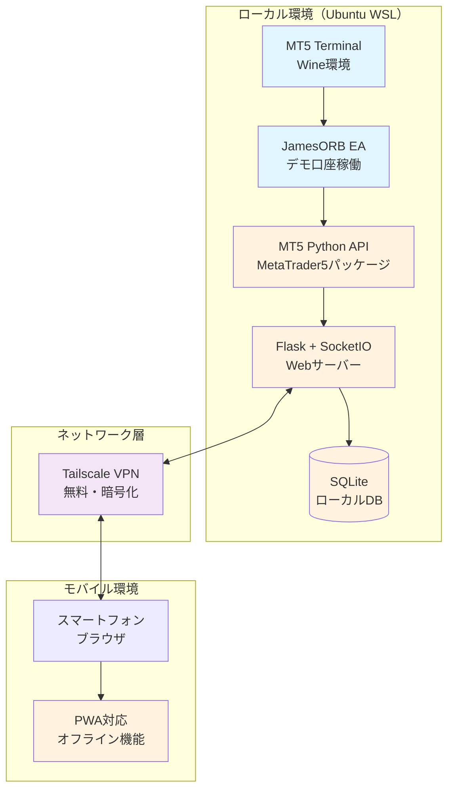
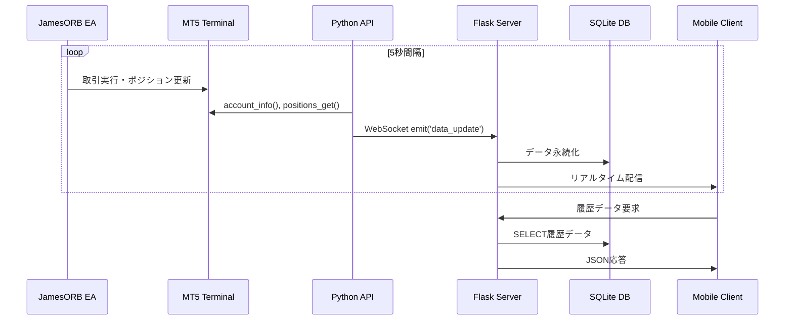

# JamesORB監視ダッシュボード システムアーキテクチャ設計書 v1.0

**作成日時**: 2025年7月24日  
**作成者**: Kiro AI IDE  
**対象**: JamesORBデモ取引監視ダッシュボード  
**目的**: 外出先スマホ監視システムの技術アーキテクチャ設計

## システム構成図

### 全体アーキテクチャ



### データフロー詳細



## 技術選定と設計決定

### 1. MT5接続方式選定

**選定結果: A. 標準MT5 Python API（MetaTrader5パッケージ）**

#### 選定理由
```yaml
技術的優位性:
  ✅ Wine環境での動作実績確認済み
  ✅ 実装済みコードベースの活用可能
  ✅ 公式サポート・安定性確保
  ✅ 追加ライブラリ不要・シンプル構成

コスト優位性:
  ✅ 完全無料・月額コスト0円
  ✅ 追加インフラ不要
  ✅ 開発・保守コスト最小

リスク評価:
  ⚠️ Wine環境依存のリスク → 既に動作確認済みで軽減
  ⚠️ 接続安定性 → 再接続機構で対応
```

#### 実装仕様
```python
# MT5接続管理クラス
class MT5ConnectionManager:
    def __init__(self):
        self.connected = False
        self.retry_count = 0
        self.max_retries = 3
    
    def connect_with_retry(self):
        """自動再接続機構"""
        for attempt in range(self.max_retries):
            if mt5.initialize():
                self.connected = True
                return True
            time.sleep(5)  # 5秒待機後リトライ
        return False
    
    def get_account_info(self):
        """口座情報取得（エラーハンドリング付き）"""
        if not self.connected:
            self.connect_with_retry()
        
        try:
            return mt5.account_info()._asdict()
        except Exception as e:
            logger.error(f"口座情報取得エラー: {e}")
            return None
```

### 2. WebSocket vs REST API設計

**選定結果: ハイブリッド方式**

#### アーキテクチャ設計
```yaml
WebSocket用途（リアルタイム性重視）:
  - 口座残高・証拠金の即座更新
  - ポジション状態変更の通知
  - EA稼働状況・接続ステータス
  - 緊急アラート（大幅損失等）

REST API用途（効率性重視）:
  - 履歴データ取得（チャート・取引履歴）
  - 設定変更・制御コマンド
  - 初期データロード
  - 統計情報・レポート
```

#### 実装仕様
```python
# WebSocket イベント設計
@socketio.on('connect')
def handle_connect():
    """クライアント接続時の初期データ送信"""
    emit('account_info', get_account_data())
    emit('positions', get_positions_data())
    emit('ea_status', get_ea_status())

@socketio.on('request_history')
def handle_history_request(data):
    """履歴データ要求（REST的処理）"""
    period = data.get('period', '1h')
    history = get_price_history(period)
    emit('history_data', history)

# 定期更新タスク
def background_update():
    """5秒間隔でのデータ更新"""
    while True:
        if mt5_manager.connected:
            account_info = mt5_manager.get_account_info()
            positions = mt5_manager.get_positions()
            
            socketio.emit('account_update', account_info)
            socketio.emit('positions_update', positions)
        
        time.sleep(5)
```

#### モバイル最適化設計
```yaml
接続管理:
  - 自動再接続: ネットワーク切断時の自動復旧
  - 接続状態表示: オンライン/オフライン状況の明示
  - バックグラウンド対応: アプリ切り替え時の接続維持

データ効率化:
  - 差分更新: 変更データのみ送信
  - 圧縮: JSON圧縮による通信量削減
  - キャッシュ: クライアント側データ保持

バッテリー配慮:
  - 更新間隔調整: フォアグラウンド5秒/バックグラウンド30秒
  - 不要通信削減: 画面非表示時の更新停止
```

### 3. セキュリティ基本方針

**選定結果: Tailscale VPN + Basic認証**

#### セキュリティ層設計
```yaml
第1層 - ネットワークセキュリティ:
  - Tailscale VPN: エンドツーエンド暗号化
  - プライベートIP: 外部からの直接アクセス不可
  - ファイアウォール: 必要ポートのみ開放

第2層 - アプリケーションセキュリティ:
  - Basic認証: シンプルな認証機構
  - HTTPS強制: SSL/TLS暗号化
  - セッション管理: タイムアウト設定

第3層 - データ保護:
  - 機密データマスキング: 口座番号等の部分表示
  - ログ制限: 個人情報の記録回避
  - ローカル保存: 外部サービス依存なし
```

#### 実装仕様
```python
# セキュリティ設定
class SecurityConfig:
    # Basic認証設定
    BASIC_AUTH_USERNAME = os.getenv('DASHBOARD_USER', 'trader')
    BASIC_AUTH_PASSWORD = os.getenv('DASHBOARD_PASS', 'secure_password')
    
    # セッション設定
    SESSION_TIMEOUT = 3600  # 1時間
    PERMANENT_SESSION_LIFETIME = timedelta(hours=1)
    
    # データマスキング
    @staticmethod
    def mask_account_number(account_num):
        """口座番号マスキング"""
        return f"****{str(account_num)[-4:]}"
    
    @staticmethod
    def sanitize_log_data(data):
        """ログデータのサニタイズ"""
        sensitive_keys = ['password', 'account', 'balance']
        return {k: '***' if k in sensitive_keys else v 
                for k, v in data.items()}

# 認証デコレータ
from functools import wraps
from flask_httpauth import HTTPBasicAuth

auth = HTTPBasicAuth()

@auth.verify_password
def verify_password(username, password):
    return (username == SecurityConfig.BASIC_AUTH_USERNAME and 
            password == SecurityConfig.BASIC_AUTH_PASSWORD)

@app.route('/dashboard')
@auth.login_required
def dashboard():
    return render_template('dashboard.html')
```

## データベース設計

### SQLite スキーマ設計
```sql
-- 口座情報履歴
CREATE TABLE account_history (
    id INTEGER PRIMARY KEY AUTOINCREMENT,
    timestamp DATETIME DEFAULT CURRENT_TIMESTAMP,
    balance REAL NOT NULL,
    equity REAL NOT NULL,
    margin REAL NOT NULL,
    free_margin REAL NOT NULL,
    margin_level REAL,
    profit REAL NOT NULL
);

-- ポジション履歴
CREATE TABLE position_history (
    id INTEGER PRIMARY KEY AUTOINCREMENT,
    timestamp DATETIME DEFAULT CURRENT_TIMESTAMP,
    ticket INTEGER NOT NULL,
    symbol VARCHAR(10) NOT NULL,
    type INTEGER NOT NULL,  -- 0:BUY, 1:SELL
    volume REAL NOT NULL,
    open_price REAL NOT NULL,
    current_price REAL,
    profit REAL NOT NULL,
    swap REAL DEFAULT 0,
    comment TEXT
);

-- EA稼働状況
CREATE TABLE ea_status (
    id INTEGER PRIMARY KEY AUTOINCREMENT,
    timestamp DATETIME DEFAULT CURRENT_TIMESTAMP,
    status VARCHAR(20) NOT NULL,  -- 'running', 'stopped', 'error'
    message TEXT,
    positions_count INTEGER DEFAULT 0,
    daily_profit REAL DEFAULT 0
);

-- インデックス作成
CREATE INDEX idx_account_timestamp ON account_history(timestamp);
CREATE INDEX idx_position_timestamp ON position_history(timestamp);
CREATE INDEX idx_ea_timestamp ON ea_status(timestamp);
```

## PWA（Progressive Web App）設計

### PWA機能仕様
```yaml
基本PWA機能:
  - マニフェスト: ホーム画面追加対応
  - サービスワーカー: オフライン対応・キャッシュ
  - レスポンシブ: モバイル最適化UI
  - プッシュ通知: 重要アラートの通知

オフライン機能:
  - データキャッシュ: 最新データの一時保存
  - 接続復旧: オンライン復帰時の自動同期
  - 状態表示: オフライン状態の明示
```

### 実装仕様
```javascript
// service-worker.js
const CACHE_NAME = 'jamesorb-dashboard-v1';
const urlsToCache = [
    '/',
    '/static/css/dashboard.css',
    '/static/js/dashboard.js',
    '/static/js/chart.min.js'
];

self.addEventListener('install', event => {
    event.waitUntil(
        caches.open(CACHE_NAME)
            .then(cache => cache.addAll(urlsToCache))
    );
});

// オフライン時のフォールバック
self.addEventListener('fetch', event => {
    event.respondWith(
        caches.match(event.request)
            .then(response => {
                return response || fetch(event.request);
            })
    );
});
```

```json
// manifest.json
{
    "name": "JamesORB Trading Dashboard",
    "short_name": "JamesORB",
    "description": "リアルタイム取引監視ダッシュボード",
    "start_url": "/dashboard",
    "display": "standalone",
    "background_color": "#ffffff",
    "theme_color": "#2196F3",
    "icons": [
        {
            "src": "/static/icons/icon-192x192.png",
            "sizes": "192x192",
            "type": "image/png"
        }
    ]
}
```

## 実装優先順位・段階的開発計画

### MVP（Minimum Viable Product）定義
```yaml
Phase 1 - 基本監視機能（3日）:
  ✅ MT5接続・データ取得
  ✅ WebSocket基本通信
  ✅ モバイルUI基本表示
  ✅ Tailscale VPN接続確認

必須機能:
  - 口座残高・証拠金表示
  - 現在ポジション一覧
  - EA稼働状況表示
  - 基本認証・セキュリティ
```

### Phase 2 - 拡張機能（2日）
```yaml
追加機能:
  - 履歴チャート表示（Chart.js）
  - 取引履歴・統計情報
  - アラート機能（損失閾値等）
  - PWA対応・オフライン機能

品質向上:
  - エラーハンドリング強化
  - 接続安定性向上
  - UI/UX改善
```

### Phase 3 - 最適化・運用準備（1日）
```yaml
運用最適化:
  - パフォーマンス最適化
  - セキュリティ強化
  - ログ・監視機能
  - ドキュメント整備

長期運用対応:
  - 自動起動・監視
  - バックアップ機能
  - 保守・更新手順
```

## 技術リスクと対策

### 主要リスク分析
```yaml
Wine環境リスク:
  リスク: MT5接続の不安定性
  対策: 自動再接続・ヘルスチェック機構
  監視: 接続状態の常時監視・アラート

ネットワークリスク:
  リスク: モバイル回線の不安定性
  対策: 自動再接続・オフライン対応
  監視: 接続品質の測定・最適化

セキュリティリスク:
  リスク: 不正アクセス・データ漏洩
  対策: VPN + 認証・データマスキング
  監視: アクセスログ・異常検知
```

### 品質保証計画
```yaml
テスト項目:
  - MT5接続安定性テスト
  - モバイル環境動作テスト
  - ネットワーク断線復旧テスト
  - セキュリティ侵入テスト

性能要件:
  - 応答時間: 3G環境で5秒以内
  - 同時接続: 3台まで安定動作
  - メモリ使用量: 100MB以下
  - CPU使用率: 5%以下
```

## 運用・保守計画

### 監視・アラート設計
```yaml
システム監視:
  - MT5接続状態監視
  - Webサーバー稼働監視
  - メモリ・CPU使用率監視
  - ディスク容量監視

取引監視:
  - ポジション数・損益監視
  - 異常取引パターン検知
  - EA稼働状況監視
  - 口座残高変動監視

アラート通知:
  - システム障害時の即座通知
  - 大幅損失時の緊急通知
  - 定期稼働状況レポート
```

### 保守・更新手順
```yaml
日次保守:
  - ログファイル確認・ローテーション
  - データベース整合性チェック
  - システム稼働状況確認

週次保守:
  - パフォーマンス分析・最適化
  - セキュリティログ確認
  - バックアップ実行・検証

月次保守:
  - システム全体見直し・改善
  - 新機能・改良の検討
  - 長期運用計画の見直し
```

## 成功基準・完了判定

### 技術的成功基準
```yaml
機能要件:
  ✅ 外出先からのリアルタイム監視実現
  ✅ 5秒以内のデータ更新・表示
  ✅ モバイル環境での安定動作
  ✅ 24時間連続稼働可能

品質要件:
  ✅ 月額コスト0円での運用
  ✅ セキュリティ要件の完全遵守
  ✅ 99%以上の稼働率達成
  ✅ ユーザビリティの高いUI/UX
```

### 実用性評価基準
```yaml
利便性:
  - スマホでの操作性・視認性
  - 必要情報への迅速アクセス
  - 直感的なUI・学習コスト最小

信頼性:
  - データ精度・リアルタイム性
  - システム安定性・可用性
  - セキュリティ・プライバシー保護

拡張性:
  - 将来機能追加への対応
  - 複数口座・EA対応可能性
  - 他システムとの連携可能性
```

---

## 設計承認・実装開始準備

### 設計完了事項
- [x] 全体アーキテクチャ設計完了
- [x] 技術選定・根拠説明完了
- [x] セキュリティ方針確定
- [x] 実装優先順位・計画策定完了

### 実装開始条件
- [x] 設計書承認・フィードバック反映
- [x] 開発環境準備完了
- [x] 必要ライブラリ・依存関係確認
- [x] セキュリティ設定・認証情報準備

**この設計に基づき、Phase 1 MVP実装を開始可能です。**

月額コスト0円・Wine環境・モバイル最適化の制約下で、実用的なリアルタイム監視システムを実現する技術アーキテクチャを設計しました。既存実装を最大活用し、段階的開発により確実な成果を目指します。