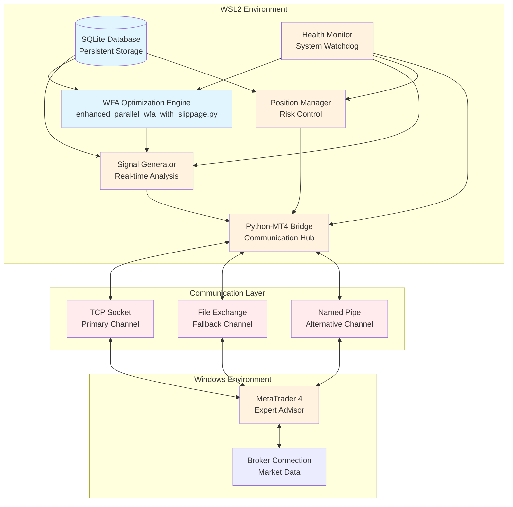
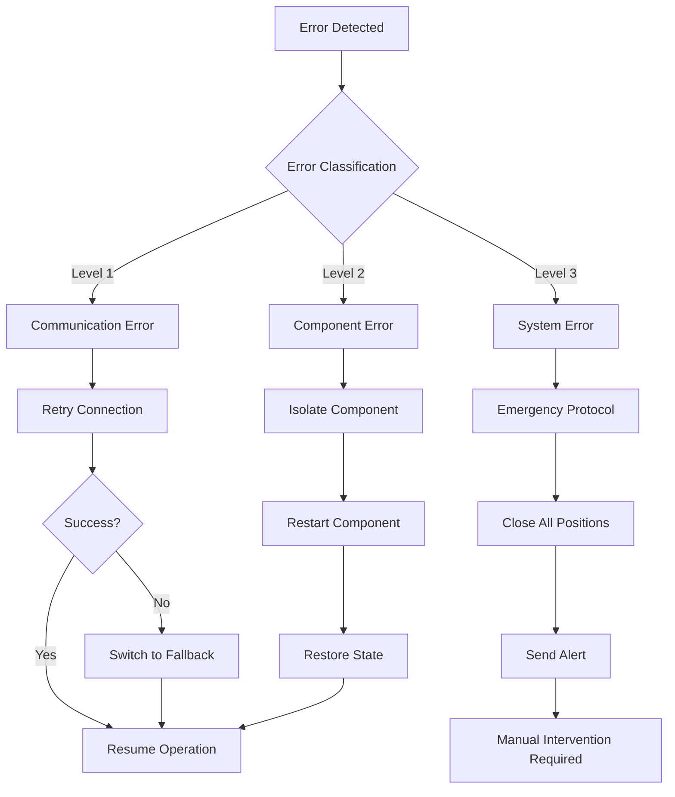

# Design Document

**作成日時**: 2025年7月18日 07:22 JST  
**作成者**: Kiro AI IDE  
**プロジェクト**: ブレイクアウト手法実運用システム統合プロジェクト

## Overview

本システムは、既存のGemini満点Python WFAシステムを基盤として、MT4との連携による実取引実行機能を追加する統合システムである。WSL2環境のPythonシステムとWindows環境のMT4間の高速・安定通信を実現し、リアルタイム取引実行を可能にする。

### Key Design Principles

1. **既存システム保護**: Gemini 5.0/5.0評価システムの変更禁止
2. **段階的統合**: Phase分割による低リスク実装
3. **高可用性**: 99%以上の稼働率確保
4. **低レイテンシ**: 50ms以下の通信遅延
5. **自動回復**: 障害時の自動復旧機能

## Architecture

### System Architecture Diagram



## Components and Interfaces

### 1. WFA Optimization Engine (Existing)
**File**: `enhanced_parallel_wfa_with_slippage.py`
**Status**: Protected - No modifications allowed
**Interface**: 
- Input: Market data, configuration parameters
- Output: Optimized parameters, performance metrics
- Communication: Database persistence, signal generation trigger

### 2. Real-time Signal Generator (New)
**Purpose**: Market monitoring and signal generation
**Key Interfaces**:
```python
class SignalGenerator:
    def get_market_data() -> pd.DataFrame
    def generate_signals(params: Dict) -> List[Signal]
    def evaluate_signal_quality(signal: Signal) -> float
    def send_signal_to_mt4(signal: Signal) -> bool
```

### 3. Python-MT4 Bridge (Critical Component)
**Purpose**: Cross-platform communication hub
**Communication Protocols**:

#### Primary: TCP Socket Communication
```python
class TCPBridge:
    def __init__(self, host='localhost', port=9090):
        self.socket = socket.socket(socket.AF_INET, socket.SOCK_STREAM)
        self.reconnect_attempts = 3
        self.timeout = 5.0
    
    def send_signal(self, signal: TradingSignal) -> bool
    def receive_execution_report(self) -> ExecutionReport
    def heartbeat_check() -> bool
```

#### Fallback: File-based Communication
```python
class FileBridge:
    def __init__(self, shared_dir='/mnt/c/MT4_Bridge'):
        self.signal_file = f"{shared_dir}/signals.json"
        self.status_file = f"{shared_dir}/status.json"
        self.lock_timeout = 1.0
    
    def write_signal_file(self, signal: TradingSignal) -> bool
    def read_status_file() -> SystemStatus
```

#### Alternative: Named Pipe Communication
```python
class NamedPipeBridge:
    def __init__(self, pipe_name='\\\\.\\pipe\\MT4Bridge'):
        self.pipe_name = pipe_name
        self.buffer_size = 4096
    
    def connect_pipe() -> bool
    def send_message(self, message: str) -> bool
```

### 4. Position Management System (New)
**Purpose**: Risk control and position tracking
**Key Functions**:
- Position sizing calculation
- Risk limit monitoring
- Drawdown protection
- Performance tracking

### 5. MT4 Expert Advisor (New)
**Language**: MQL4
**Key Functions**:
```mql4
// Signal reception and processing
bool ReceivePythonSignal();
bool ExecuteTrade(string signal);

// Position management
double CalculatePositionSize(double riskPercent);
bool ManageOpenPositions();

// Communication with Python
bool SendExecutionReport(int ticket, double fillPrice);
bool SendHeartbeat();
```

### 6. Health Monitor (New)
**Purpose**: System-wide health monitoring
**Monitoring Targets**:
- Component availability
- Communication latency
- Memory/CPU usage
- Database integrity
- Network connectivity

## Data Models

### Trading Signal
```python
@dataclass
class TradingSignal:
    timestamp: datetime
    symbol: str
    action: str  # 'BUY', 'SELL', 'CLOSE'
    quantity: float
    price: Optional[float]
    stop_loss: Optional[float]
    take_profit: Optional[float]
    signal_quality: float
    strategy_params: Dict
```

### Execution Report
```python
@dataclass
class ExecutionReport:
    signal_id: str
    execution_time: datetime
    fill_price: float
    fill_quantity: float
    slippage: float
    commission: float
    ticket_number: int
    status: str  # 'FILLED', 'PARTIAL', 'REJECTED'
```

### System Status
```python
@dataclass
class SystemStatus:
    timestamp: datetime
    component_health: Dict[str, bool]
    communication_latency: Dict[str, float]
    active_positions: int
    daily_pnl: float
    system_uptime: float
```

## Error Handling

### Error Classification and Response

#### Level 1: Communication Errors
- **TCP Connection Lost**: Automatic reconnection (max 3 attempts)
- **File Lock Timeout**: Retry with exponential backoff
- **Named Pipe Broken**: Switch to alternative communication method

#### Level 2: Component Failures
- **Signal Generator Failure**: Continue with last known good parameters
- **Position Manager Failure**: Emergency position closure
- **MT4 EA Crash**: Restart EA and restore state

#### Level 3: System-wide Failures
- **Database Corruption**: Restore from backup and alert
- **Network Outage**: Maintain protective stops, halt new trades
- **WSL2 System Failure**: Emergency shutdown protocol

### Recovery Flow Diagram



## Testing Strategy

### Unit Testing
- Individual component testing
- Mock interfaces for external dependencies
- Performance benchmarking for critical paths

### Integration Testing
- End-to-end signal flow testing
- Communication protocol validation
- Failover scenario testing

### System Testing
- Load testing with historical data
- Stress testing under high volatility
- Recovery testing from various failure states

### Performance Testing
- Latency measurement (<50ms requirement)
- Throughput testing (signals per second)
- Resource utilization monitoring

## Security Considerations

### Communication Security
- Local network communication only
- Message integrity validation
- Connection authentication

### Data Protection
- Encrypted database storage
- Secure file permissions
- Audit trail logging

### Access Control
- Component-level access restrictions
- Configuration file protection
- Log file access control

## Performance Optimization

### Latency Optimization
- Connection pooling for TCP sockets
- Message batching for non-critical updates
- Asynchronous processing where possible

### Resource Management
- Memory pool allocation
- CPU affinity for critical processes
- Disk I/O optimization

### Scalability Considerations
- Horizontal scaling capability
- Load balancing for multiple MT4 instances
- Database partitioning strategy