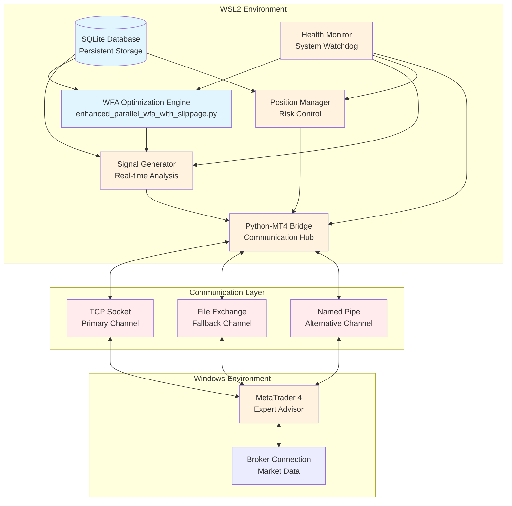
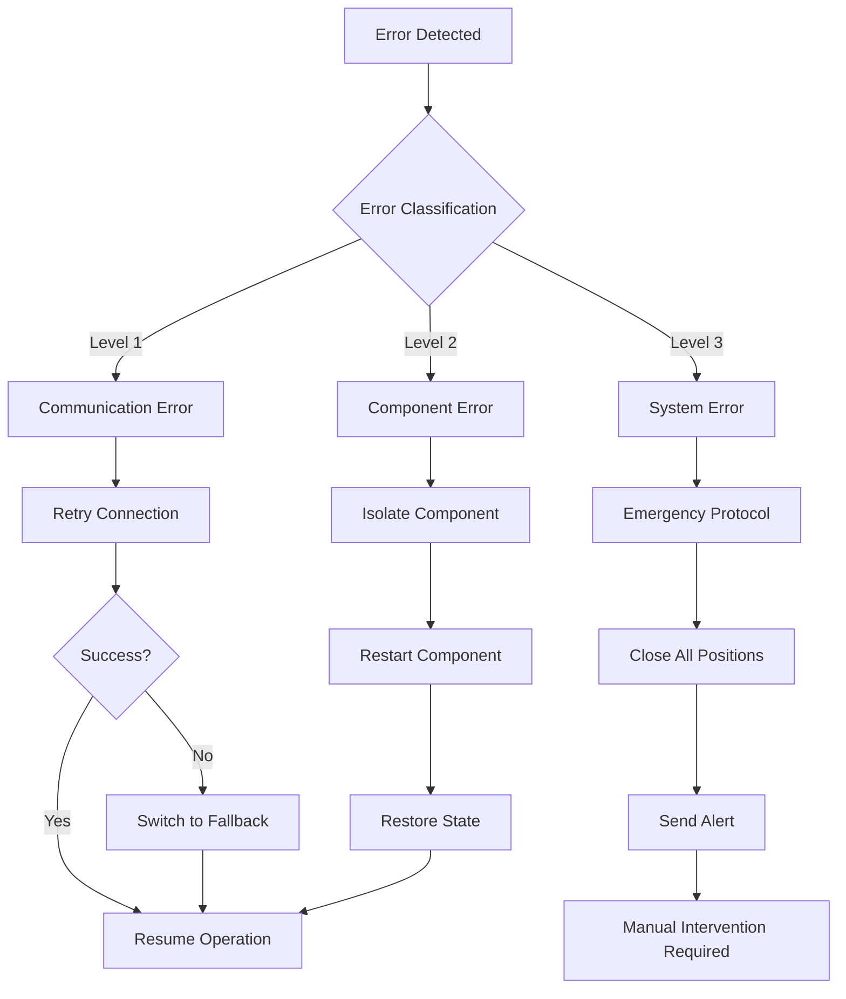

# 設計書

**作成日時**: 2025年7月18日 07:22 JST  
**作成者**: Kiro AI IDE  
**プロジェクト**: ブレイクアウト手法実運用システム統合プロジェクト

## 概要

本システムは、既存のGemini満点Python WFAシステムを基盤として、MT4との連携による実取引実行機能を追加する統合システムである。WSL2環境のPythonシステムとWindows環境のMT4間の高速・安定通信を実現し、リアルタイム取引実行を可能にする。

### 主要設計原則

1. **既存システム保護**: Gemini 5.0/5.0評価システムの変更禁止
2. **段階的統合**: フェーズ分割による低リスク実装
3. **高可用性**: 99%以上の稼働率確保
4. **低レイテンシ**: 50ms以下の通信遅延
5. **自動回復**: 障害時の自動復旧機能

## アーキテクチャ

### システムアーキテクチャ図



## コンポーネントとインターフェース

### 1. WFA最適化エンジン（既存）
**ファイル**: `enhanced_parallel_wfa_with_slippage.py`
**ステータス**: 保護対象 - 変更禁止
**インターフェース**: 
- 入力: 市場データ、設定パラメータ
- 出力: 最適化パラメータ、パフォーマンス指標
- 通信: データベース永続化、シグナル生成トリガー

### 2. リアルタイムシグナル生成器（新規）
**目的**: 市場監視とシグナル生成
**主要インターフェース**:
```python
class SignalGenerator:
    def get_market_data() -> pd.DataFrame
    def generate_signals(params: Dict) -> List[Signal]
    def evaluate_signal_quality(signal: Signal) -> float
    def send_signal_to_mt4(signal: Signal) -> bool
```

### 3. Python-MT4ブリッジ（重要コンポーネント）
**目的**: クロスプラットフォーム通信ハブ
**通信プロトコル**:

#### 主要: TCPソケット通信
```python
class TCPBridge:
    def __init__(self, host='localhost', port=9090):
        self.socket = socket.socket(socket.AF_INET, socket.SOCK_STREAM)
        self.reconnect_attempts = 3
        self.timeout = 5.0
    
    def send_signal(self, signal: TradingSignal) -> bool
    def receive_execution_report(self) -> ExecutionReport
    def heartbeat_check() -> bool
```

#### フォールバック: ファイルベース通信
```python
class FileBridge:
    def __init__(self, shared_dir='/mnt/c/MT4_Bridge'):
        self.signal_file = f"{shared_dir}/signals.json"
        self.status_file = f"{shared_dir}/status.json"
        self.lock_timeout = 1.0
    
    def write_signal_file(self, signal: TradingSignal) -> bool
    def read_status_file() -> SystemStatus
```

#### 代替: 名前付きパイプ通信
```python
class NamedPipeBridge:
    def __init__(self, pipe_name='\\\\.\\pipe\\MT4Bridge'):
        self.pipe_name = pipe_name
        self.buffer_size = 4096
    
    def connect_pipe() -> bool
    def send_message(self, message: str) -> bool
```

### 4. ポジション管理システム（新規）
**目的**: リスク制御とポジション追跡
**主要機能**:
- ポジションサイズ計算
- リスク限界監視
- ドローダウン保護
- パフォーマンス追跡

### 5. MT4エキスパートアドバイザー（新規）
**言語**: MQL4
**主要機能**:
```mql4
// シグナル受信と処理
bool ReceivePythonSignal();
bool ExecuteTrade(string signal);

// ポジション管理
double CalculatePositionSize(double riskPercent);
bool ManageOpenPositions();

// Pythonとの通信
bool SendExecutionReport(int ticket, double fillPrice);
bool SendHeartbeat();
```

### 6. ヘルスモニター（新規）
**目的**: システム全体の健全性監視
**監視対象**:
- コンポーネント可用性
- 通信レイテンシ
- メモリ/CPU使用量
- データベース整合性
- ネットワーク接続性

## データモデル

### 取引シグナル
```python
@dataclass
class TradingSignal:
    timestamp: datetime
    symbol: str
    action: str  # 'BUY', 'SELL', 'CLOSE'
    quantity: float
    price: Optional[float]
    stop_loss: Optional[float]
    take_profit: Optional[float]
    signal_quality: float
    strategy_params: Dict
```

### 実行レポート
```python
@dataclass
class ExecutionReport:
    signal_id: str
    execution_time: datetime
    fill_price: float
    fill_quantity: float
    slippage: float
    commission: float
    ticket_number: int
    status: str  # 'FILLED', 'PARTIAL', 'REJECTED'
```

### システムステータス
```python
@dataclass
class SystemStatus:
    timestamp: datetime
    component_health: Dict[str, bool]
    communication_latency: Dict[str, float]
    active_positions: int
    daily_pnl: float
    system_uptime: float
```

## エラーハンドリング

### エラー分類と対応

#### レベル1: 通信エラー
- **TCP接続切断**: 自動再接続（最大3回試行）
- **ファイルロックタイムアウト**: 指数バックオフでリトライ
- **名前付きパイプ破損**: 代替通信方式に切り替え

#### レベル2: コンポーネント障害
- **シグナル生成器障害**: 最後の正常パラメータで継続
- **ポジション管理器障害**: 緊急ポジション決済
- **MT4 EAクラッシュ**: EA再起動と状態復元

#### レベル3: システム全体障害
- **データベース破損**: バックアップから復元とアラート
- **ネットワーク障害**: 保護ストップ維持、新規取引停止
- **WSL2システム障害**: 緊急シャットダウンプロトコル

### 復旧フロー図



## テスト戦略

### 単体テスト
- 個別コンポーネントテスト
- 外部依存関係のモックインターフェース
- 重要パスのパフォーマンスベンチマーク

### 統合テスト
- エンドツーエンドシグナルフローテスト
- 通信プロトコル検証
- フェイルオーバーシナリオテスト

### システムテスト
- 履歴データを使用した負荷テスト
- 高ボラティリティ下でのストレステスト
- 各種障害状態からの復旧テスト

### パフォーマンステスト
- レイテンシ測定（50ms要件）
- スループットテスト（秒間シグナル数）
- リソース使用率監視

## セキュリティ考慮事項

### 通信セキュリティ
- ローカルネットワーク通信のみ
- メッセージ整合性検証
- 接続認証

### データ保護
- 暗号化データベースストレージ
- セキュアファイル権限
- 監査証跡ログ

### アクセス制御
- コンポーネントレベルアクセス制限
- 設定ファイル保護
- ログファイルアクセス制御

## パフォーマンス最適化

### レイテンシ最適化
- TCPソケット用接続プール
- 非重要更新のメッセージバッチ処理
- 可能な限りの非同期処理

### リソース管理
- メモリプール割り当て
- 重要プロセスのCPUアフィニティ
- ディスクI/O最適化

### スケーラビリティ考慮事項
- 水平スケーリング機能
- 複数MT4インスタンスの負荷分散
- データベースパーティション戦略