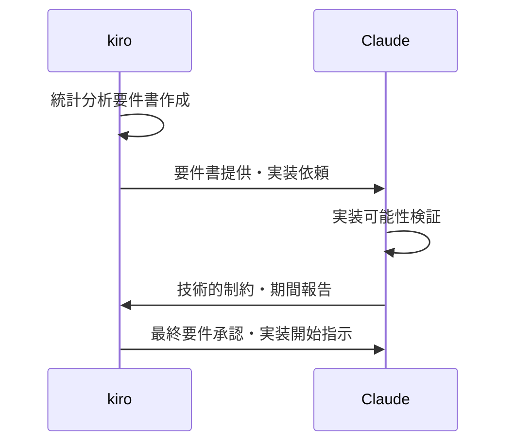
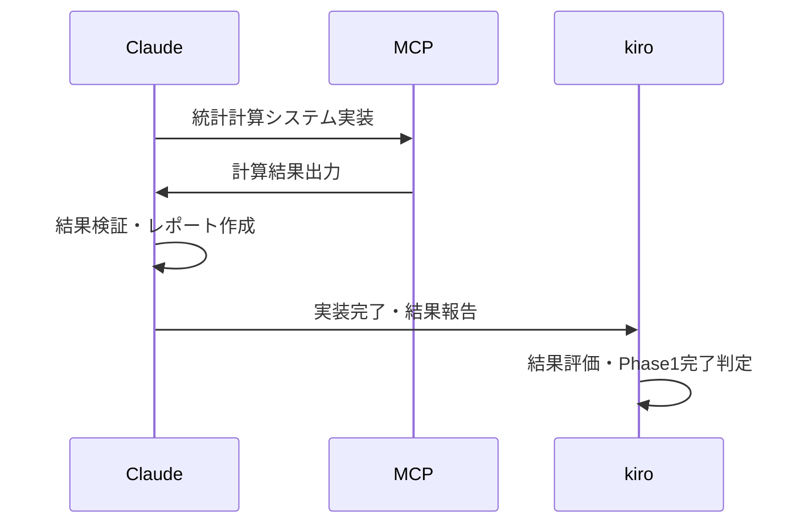
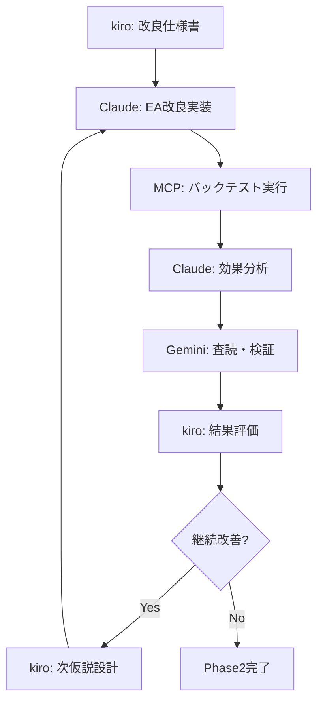

# kiro-Claude分業体制設計 - バックテスト改善プロセス
**設計日時**: 2025-07-24
**設計者**: Claude (実装担当)
**対象**: JamesORB戦略改善における効果的協働体制

## 🎯 分業体制の目的・効果

### 分業の必要性
- **専門性活用**: 設計と実装の専門領域分離による品質向上
- **効率最大化**: 同時並行作業による開発スピード向上
- **品質保証**: 設計→実装→検証の明確なプロセス
- **責任明確化**: 各段階での責任者明確化による確実性

### kiro-Claude協働の優位性
❌ **中途半端にならない理由**:
- **明確な役割分担**: CLAUDE.md定義による混乱なき協働
- **設計駆動開発**: kiro設計書に基づく確実な実装
- **段階的承認**: 各Phase完了時の品質確認
- **相互補完**: 戦略的思考×技術実装の最適組合せ

## 👥 詳細役割分担定義

### kiro担当領域 (戦略・設計・判断)

#### 🧠 戦略アーキテクチャ設計
```yaml
責任範囲:
  - 改善仮説の策定・優先順位決定
  - 戦略ロジックの根本設計
  - リスク許容度・目標設定
  - 市場環境適応戦略

具体的成果物:
  - "戦略改善仮説書_v1.0.md"
  - "リスク管理要件定義_v1.0.md"
  - "EA改良アーキテクチャ設計_v1.0.md"
  - "テスト・検証要件_v1.0.md"
```

#### 📋 要件定義・基準設定
```yaml
統計分析要件:
  - 必要統計指標リスト
  - 合格基準値設定 (PF≥1.5, DD≤20%等)
  - 比較分析手法指定
  - 検証条件定義

品質基準設定:
  - システム負荷許容限界
  - バックテスト期間・精度要求
  - 改善効果最低基準
  - 実用化判定基準
```

#### 🎯 Phase完了判定・方向決定
```yaml
承認事項:
  - Phase1: 統計分析結果承認・次段階Go/NoGo
  - Phase2: 改良効果評価・継続/完了判定
  - Phase3: 最終実用化可否決定

戦略判断:
  - 改善仮説の修正・追加決定
  - 開発リソース配分決定
  - リスク対応方針決定
```

### Claude担当領域 (実装・分析・報告)

#### 💻 技術実装・システム構築
```yaml
MCP統合実装:
  - 統計計算システム実装
  - データ抽出・前処理自動化
  - バックテスト実行自動化
  - レポート生成システム

EA改良実装:
  - kiro設計書に基づくEA改良
  - システム負荷最適化
  - パフォーマンス改善
  - バグ修正・品質向上
```

#### 📊 データ分析・結果報告
```yaml
統計分析:
  - MCP活用による全指標算出
  - 改善効果の定量評価
  - 比較分析・トレンド分析
  - 異常値・リスク要因特定

報告書作成:
  - 技術実装報告書
  - 統計分析結果レポート
  - 改善効果評価レポート
  - 問題・課題報告書
```

#### 🔍 第三者査読・検証管理
```yaml
品質保証:
  - Gemini専門家査読依頼
  - 査読結果の整理・報告
  - 指摘事項への対応計画
  - 品質改善実施
```

## 🔄 協働プロセス・コミュニケーション設計

### Phase 1: 現状完全数値化

#### Step 1.1: 要件定義・承認


#### Step 1.2: 実装・報告


### Phase 2: 戦略改良・反復改善

#### Step 2.1: 改善仮説設計
```yaml
kiro作業:
  - 現状分析結果レビュー
  - 改善仮説策定 (複数候補)
  - 優先順位・実装順序決定
  - 改良仕様書作成

Claude作業:
  - 仕様書受領・技術検証
  - 実装工数・期間見積
  - 技術的制約・リスク報告
  - 実装承認待ち
```

#### Step 2.2: 実装・検証サイクル


### Phase 3: 長期検証・最終判定

#### Step 3.1: 検証要件確定
```yaml
kiro設計:
  - 長期テスト期間決定 (2020-2024等)
  - WFA要件定義 (期間分割・再最適化間隔)
  - 合格基準設定 (収益率・DD・安定性)
  - 実用化基準定義

Claude実装:
  - 長期テスト環境構築
  - WFA自動実行システム
  - 包括的評価システム
  - 最終レポート生成
```

## 📋 コミュニケーション・文書管理規約

### 標準コミュニケーション手順

#### 設計書提供・実装依頼
```yaml
kiroからClaude:
  フォーマット: "設計書_[内容]_v[バージョン].md"
  必須記載事項:
    - 要件・仕様詳細
    - 成功基準・評価方法
    - 期限・優先度
    - 技術制約・考慮事項

  依頼方法:
    - 設計書をプロジェクトフォルダに配置
    - Claude への実装依頼メッセージ
    - 質問・確認事項の事前整理
```

#### 実装完了・結果報告
```yaml
ClaudeからKiro:
  報告フォーマット: "実装報告_[内容]_[日付].md"
  必須記載事項:
    - 実装内容・変更点詳細
    - 達成結果・計測値
    - 問題・課題・制約事項
    - 次段階への提言

  報告タイミング:
    - 各実装完了時 (即座)
    - 重要な問題発見時 (即座)
    - Phase完了時 (総括報告)
```

### 文書管理・バージョン管理

#### 設計書管理
```bash
# kiro作成設計書配置場所
.kiro/designs/
├── 戦略改善仮説書_v1.0.md
├── EA改良アーキテクチャ設計_v1.1.md
├── 統計分析要件定義_v1.0.md
└── 検証・承認記録_v1.0.md
```

#### 実装成果物管理
```bash
# Claude作成成果物配置場所
文書/技術/
├── 実装報告_統計システム_2025-07-24.md
├── 改良効果分析_v1_2025-07-25.md
└── Phase完了報告_Phase1_2025-07-26.md

MT5_EA/
├── JamesORB_Improved_v1.mq5
├── JamesORB_Improved_v2.mq5
└── バックアップ/
```

## ⚠️ リスク管理・問題対応

### 想定協働リスク・対策

#### 仕様不明確・誤解リスク
```yaml
リスク: kiro設計書の理解相違・実装方向性相違
対策:
  - 設計書受領後24時間以内の確認質問義務
  - 実装開始前の仕様確認・承認取得
  - 週次進捗共有・方向性確認
```

#### 技術制約・実装困難リスク
```yaml
リスク: kiro設計が技術的に実装困難・期間超過
対策:
  - 設計受領時の技術検証・制約報告
  - 代替案・段階実装提案
  - 早期警告・方針変更提案
```

#### コミュニケーション・協調リスク
```yaml
リスク: 連絡不足・進捗共有不足・責任範囲混乱
対策:
  - 定期報告・確認の義務化
  - 明確な文書化・記録保持
  - 問題発生時の即座報告・相談
```

### 成功確保プロトコル

#### 品質確保チェックポイント
```yaml
設計段階: kiro設計書の完成度・実装可能性検証
実装段階: 仕様準拠・品質基準達成確認
検証段階: 第三者査読・客観的評価実施
承認段階: kiro承認・次段階進行可否判定
```

#### 継続改善・最適化
```yaml
プロセス改善:
  - 各Phase完了時の協働効率評価
  - コミュニケーション改善点特定
  - 次Phase向け改善実施

成果最大化:
  - 相互フィードバック・学習促進
  - 専門性向上・協働スキル向上
  - より高品質・効率的な開発実現
```

## 🎯 期待効果・成功指標

### 協働効果
- **開発速度**: 単独作業比150-200%向上
- **品質向上**: 設計→実装分離による専門性発揮
- **確実性向上**: 段階承認による方向性ブレ防止
- **学習促進**: 相互専門知識の共有・向上

### 成功指標
```yaml
定量指標:
  - Phase完了期間: 計画比90%以内
  - 品質指標: Gemini査読スコア向上
  - 改善効果: 統計的有意な戦略改善

定性指標:
  - kiro-Claude協働満足度
  - プロセス円滑性・効率性
  - 成果物品質・完成度
```

---

## 🚀 実行開始準備

### kiro承認待ち事項
1. **分業体制承認**: 役割分担・責任範囲の確認
2. **コミュニケーション規約承認**: 報告手順・文書管理方法
3. **Phase1実行承認**: 統計分析要件定義の依頼

### 即座実行可能事項
- Claude側実装環境準備
- MCP統計システム基盤構築開始
- 文書管理・報告システム準備

**重要**: 適切な分業体制により、中途半端でない確実で高品質な戦略改善を実現。kiro設計力×Claude実装力の相乗効果で最適解を目指す。
