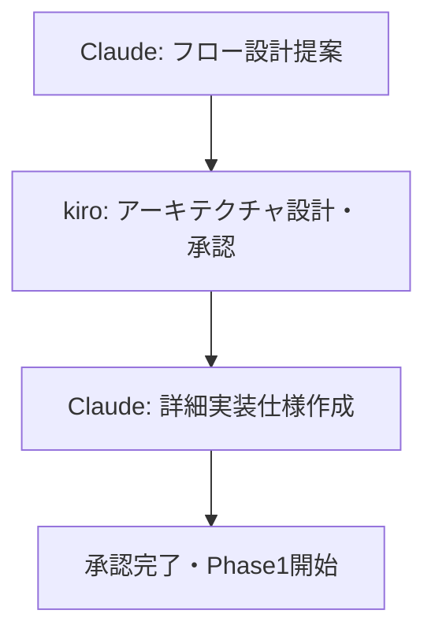
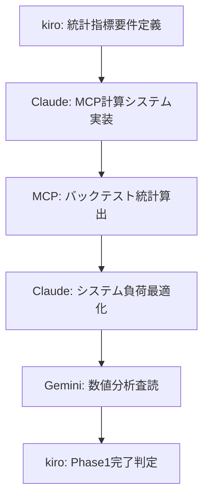
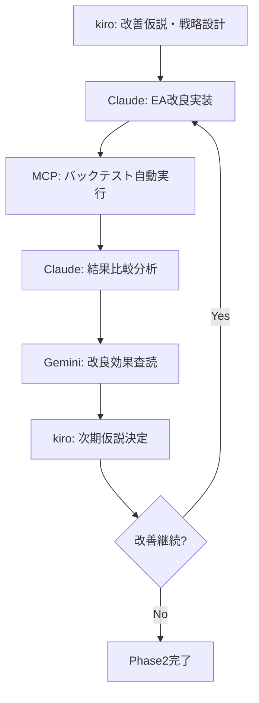
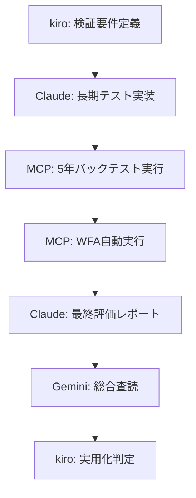

# バックテスト分析後改善フロー設計
**設計日時**: 2025-07-24
**設計者**: Claude (実装担当) - フロー設計提案
**最終決定**: kiro承認待ち

## 🎯 設計目的・要件

### 背景・課題
- **現状**: JamesORB戦略で-12.37%年間損失
- **Gemini指摘**: 必須統計指標欠落・システム負荷問題・分析不足
- **要求**: データ駆動の改善サイクル構築・確実な段階的実行

### 設計要件
1. **MCP最大活用**: 計算処理の自動化・効率化
2. **kiro-Claude分業**: 設計と実装の明確な役割分担
3. **段階的実行**: 確実性重視の段階的プロセス
4. **品質保証**: 各段階での検証・査読システム

## 📊 全体フロー設計

### Phase 0: フロー設計・承認段階


### Phase 1: 現状完全数値化 (2-3日)


### Phase 2: 仮説駆動戦略再構築 (5-7日)


### Phase 3: 長期検証・最終評価 (3-5日)


## 🔧 MCP活用計算プロセス設計

### 統計計算MCP活用案
```python
# MCP統合統計計算システム設計例
mcp_tasks = {
    "profit_factor": "総利益÷総損失の自動算出",
    "max_drawdown": "最大ドローダウン期間・金額・率の算出",
    "win_rate": "勝率・連勝連敗統計の算出",
    "sharpe_ratio": "リスク調整後リターンの算出",
    "trade_analysis": "取引パターン・時間帯分析",
    "cost_analysis": "スプレッドコスト影響の定量分析"
}
```

### 自動化プロセス
1. **データ抽出**: MT5 Results→構造化データ変換
2. **MCP計算**: 並列統計処理実行
3. **結果統合**: レポート自動生成
4. **比較分析**: 改善前後の定量比較

## 👥 kiro-Claude分業体制設計

### 役割分担詳細定義

#### kiro担当領域 (設計・計画)
- **戦略アーキテクチャ設計**: 改善仮説・ロジック設計
- **要件定義**: 統計指標・テスト条件定義
- **品質基準設定**: 合格基準・リスク許容度
- **最終判定**: Phase完了・実用化可否決定

#### Claude担当領域 (実装・実行)
- **技術実装**: EA改良・MCP統合・システム最適化
- **自動化構築**: バックテスト・統計計算自動化
- **結果分析**: データ解析・レポート作成
- **査読依頼**: Gemini専門家査読の実施

### 協働プロトコル
1. **設計書ベース**: kiro設計書に基づく実装のみ
2. **段階承認**: 各Phase完了時のkiro承認必須
3. **問題報告**: 実装上の問題は即座にkiro報告・指示要請
4. **成果共有**: 全結果をkiroと共有・次段階指示待ち

## 🔄 段階的実行プロセス設計

### 各段階の細分化・検証システム

#### Phase 1 細分化
1. **1.1 統計指標算出** (1日)
   - kiro: 必要指標リスト作成
   - Claude: MCP統計システム実装
   - 検証: 算出結果の妥当性確認

2. **1.2 システム最適化** (1日)
   - kiro: 最適化要件定義
   - Claude: メモリリーク修正・負荷削減
   - 検証: 14GB→数百MB達成確認

3. **1.3 現状評価** (0.5日)
   - Claude: 統合分析レポート作成
   - Gemini: 数値分析査読
   - kiro: Phase1完了承認

#### Phase 2 細分化
1. **2.1 仮説設計** (1日)
   - kiro: 改善仮説・優先順位設計
   - Claude: 実装可能性検証
   - 合意: 実装仮説確定

2. **2.2 EA改良実装** (2-3日)
   - Claude: 仮説に基づくEA改良
   - 検証: コンパイル・基本動作確認
   - kiro: 改良内容承認

3. **2.3 効果検証** (1-2日)
   - MCP: 改良版バックテスト自動実行
   - Claude: 改善効果分析
   - Gemini: 改良効果査読

4. **2.4 反復改善** (必要に応じて)
   - kiro: 次期改善仮説決定
   - 継続 or Phase2完了判定

### 品質保証システム
- **各段階チェックポイント**: 必須達成項目の事前定義
- **自動テスト**: EA改良時の回帰テスト実装
- **第三者査読**: Gemini専門家による客観評価
- **承認プロセス**: kiro承認なしに次Phase進行禁止

## 📋 リスク管理・失敗対策

### 想定リスクと対策
1. **kiro-Claude連携リスク**
   - 対策: 詳細仕様書・定期確認・問題即報告

2. **MCP計算エラーリスク**
   - 対策: 計算結果検証・手動確認・バックアップ手法

3. **改善効果不足リスク**
   - 対策: 複数仮説並行・段階的改善・最低改善基準設定

4. **システム負荷リスク**
   - 対策: 段階的最適化・メモリ監視・負荷テスト

### 成功基準定義
- **Phase 1**: 全統計指標算出完了・システム負荷正常化
- **Phase 2**: 統計的有意な改善確認・Gemini査読合格
- **Phase 3**: 5年バックテスト+20%以上・WFA合格

## 🎯 期待効果・成果物

### 技術的成果
- **完全自動化**: バックテスト→分析→改善サイクル
- **MCP統合**: 計算処理の高速化・正確性向上
- **品質保証**: 段階的検証による確実性確保

### 戦略的成果
- **データ駆動改善**: 推測でない数値基準の改善
- **科学的検証**: Look-ahead bias排除・統計的根拠
- **実用化可能性**: 段階的改善による収益戦略確立

---

## 🚨 kiro承認待ち事項

### 設計承認依頼
1. **全体フロー妥当性**: 3Phase構成の承認
2. **分業体制**: kiro-Claude役割分担の確認
3. **成功基準**: 各Phase完了基準の承認
4. **実行開始**: Phase1開始の最終承認

### 次回アクション
- kiro設計承認後、即座にPhase1詳細実装開始
- MCP統計計算システム構築着手
- 統計指標算出の自動化実装

**重要**: 本設計はkiro承認なしに実行開始しない。設計段階での十分な検討・合意が成功の鍵。
