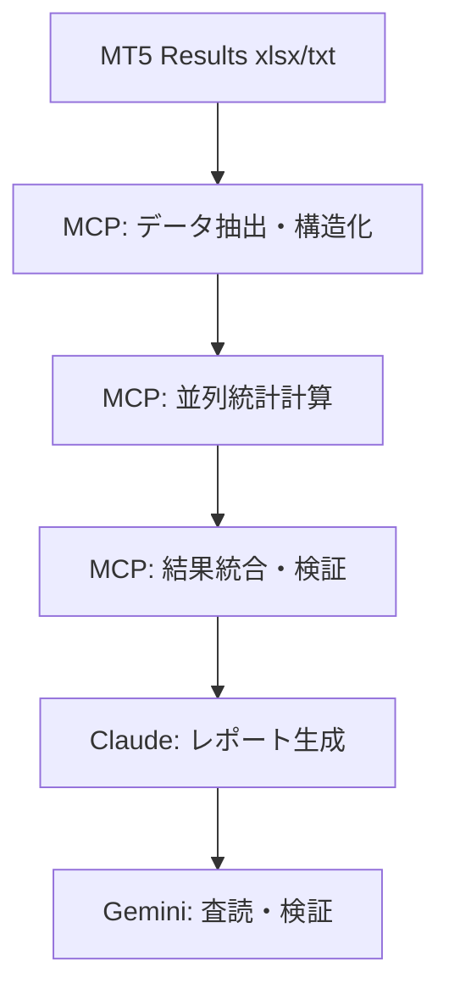

# MCP統合統計計算システム設計
**設計日時**: 2025-07-24
**設計者**: Claude (実装担当)
**対象**: バックテスト結果の完全数値化・自動統計分析

## 🎯 設計目的・要件

### 背景・課題
- **Gemini指摘**: 必須統計指標の完全欠落
- **現状問題**: 表面的損益分析のみ、戦略改善に必要な定量指標なし
- **改善要求**: データ駆動の戦略改善基盤構築

### MCP活用メリット
- **計算精度**: 人的ミス排除・統一基準での算出
- **処理速度**: 大量データの高速並列処理
- **再現性**: 同一条件での反復計算保証
- **自動化**: バックテスト→分析の完全自動フロー

## 📊 必須統計指標定義・計算仕様

### Gemini指摘必須指標

#### 1. プロフィットファクター (Profit Factor)
```python
# 計算式
profit_factor = total_gross_profit / total_gross_loss

# 評価基準
# PF ≥ 2.0: 優秀
# PF ≥ 1.5: 良好
# PF ≥ 1.2: 許容
# PF < 1.0: 損失戦略
```

#### 2. 最大ドローダウン (Maximum Drawdown)
```python
# 算出項目
max_drawdown = {
    "金額": "最大下落金額 (USD)",
    "率": "最大下落率 (%)",
    "期間": "下落開始〜回復までの日数",
    "発生日時": "最大DD発生のタイムスタンプ",
    "回復日時": "最大DD回復のタイムスタンプ (未回復の場合はNull)"
}

# 計算方法: Running Maximum vs Current Balance
running_max = max(balance_history[:i+1])
drawdown[i] = (running_max - balance[i]) / running_max * 100
```

#### 3. 勝率・取引統計
```python
# 基本統計
win_rate = winning_trades / total_trades * 100
loss_rate = losing_trades / total_trades * 100

# 連勝・連敗統計
consecutive_wins = max(consecutive_win_streak)
consecutive_losses = max(consecutive_loss_streak)

# 取引分布
profit_trades_distribution = histogram(winning_amounts)
loss_trades_distribution = histogram(losing_amounts)
```

#### 4. リスク・リワード分析
```python
# 実績値 (設定値1.9と比較)
actual_risk_reward = average_profit / average_loss

# リスク指標
sharpe_ratio = (average_return - risk_free_rate) / return_volatility
sortino_ratio = (average_return - risk_free_rate) / downside_deviation
calmar_ratio = annual_return / max_drawdown_percent
```

### 追加詳細分析指標

#### 5. 取引コスト分析
```python
# コスト算出
spread_cost = average_spread * total_trades * lot_size * pip_value
commission_cost = commission_per_lot * total_trades * lot_size
total_trading_cost = spread_cost + commission_cost

# 影響分析
net_profit_before_costs = gross_profit - gross_loss
net_profit_after_costs = net_profit_before_costs - total_trading_cost
cost_impact_percent = total_trading_cost / abs(net_profit_before_costs) * 100
```

#### 6. 時間分析
```python
# 時間帯別パフォーマンス
hourly_performance = group_by_hour(trade_results)
daily_performance = group_by_day(trade_results)
monthly_performance = group_by_month(trade_results)

# 取引頻度分析
trades_per_day = total_trades / trading_days
trades_per_week = total_trades / trading_weeks
average_trade_duration = sum(trade_durations) / total_trades
```

## 🔧 MCP統合アーキテクチャ

### データフロー設計


### MCP活用モジュール設計

#### Module 1: データ抽出・前処理
```python
# MCPタスク定義
mcp_data_extraction = {
    "input": "MT5_Results/Reportバックテスト-*.xlsx",
    "output": "structured_trade_data.json",
    "process": [
        "Excel読み込み・取引履歴抽出",
        "データ型変換・正規化",
        "異常値検出・フィルタリング",
        "時系列データ整理"
    ]
}
```

#### Module 2: 基本統計計算
```python
mcp_basic_stats = {
    "inputs": ["trade_data", "balance_history"],
    "calculations": [
        "profit_factor",
        "win_rate",
        "average_profit_loss",
        "total_trades_summary"
    ],
    "validation": "基本統計の妥当性チェック"
}
```

#### Module 3: リスク分析
```python
mcp_risk_analysis = {
    "inputs": ["balance_history", "trade_returns"],
    "calculations": [
        "maximum_drawdown_analysis",
        "sharpe_sortino_calmar_ratios",
        "value_at_risk",
        "conditional_value_at_risk"
    ],
    "output": "comprehensive_risk_metrics.json"
}
```

#### Module 4: 時系列・パターン分析
```python
mcp_pattern_analysis = {
    "inputs": ["timestamped_trades", "market_hours"],
    "calculations": [
        "hourly_daily_performance",
        "consecutive_win_loss_streaks",
        "trade_duration_analysis",
        "market_condition_correlation"
    ],
    "visualizations": "performance_charts.png"
}
```

#### Module 5: コスト・実用性分析
```python
mcp_cost_analysis = {
    "inputs": ["trade_frequency", "spread_data", "commission_rates"],
    "calculations": [
        "total_trading_costs",
        "cost_impact_on_performance",
        "break_even_analysis",
        "scalability_metrics"
    ],
    "scenarios": "different_cost_assumptions"
}
```

## 🚀 自動化実装プラン

### Phase 1: MCP統計エンジン構築
1. **データ抽出MCPタスク**: MT5 Excel/txt → 構造化JSON
2. **基本統計MCPタスク**: PF・勝率・DD算出
3. **検証システム**: 計算結果の妥当性自動チェック

### Phase 2: 高度分析統合
1. **リスク分析MCP**: シャープレシオ・VaR算出
2. **時系列分析MCP**: パフォーマンス時間分布
3. **コスト分析MCP**: 取引費用影響定量化

### Phase 3: レポート自動生成
1. **統合レポートMCP**: 全指標の統一フォーマット
2. **比較分析MCP**: 改善前後の定量比較
3. **可視化MCP**: グラフ・チャート自動生成

## 📊 計算結果出力仕様

### 標準出力フォーマット
```json
{
  "basic_metrics": {
    "profit_factor": 1.85,
    "win_rate": 67.3,
    "total_trades": 1247,
    "net_profit": -1237.40,
    "gross_profit": 8429.30,
    "gross_loss": -9666.70
  },
  "risk_metrics": {
    "max_drawdown_percent": 18.7,
    "max_drawdown_amount": 1870.00,
    "max_drawdown_duration_days": 45,
    "sharpe_ratio": -0.74,
    "sortino_ratio": -0.52,
    "calmar_ratio": -0.66
  },
  "trading_costs": {
    "estimated_spread_cost": 2494.00,
    "total_cost_impact": 201.6,
    "cost_adjusted_profit": -3731.40
  },
  "time_analysis": {
    "best_hour": "09:00-10:00 GMT",
    "worst_hour": "22:00-23:00 GMT",
    "max_consecutive_wins": 8,
    "max_consecutive_losses": 12
  }
}
```

### エラーハンドリング・品質保証
- **データ整合性チェック**: 取引数・損益整合確認
- **統計的妥当性検証**: 異常値・外れ値検出
- **計算結果クロスチェック**: 複数手法での結果一致確認
- **自動アラート**: 計算エラー・異常結果の即座通知

## 🔄 継続改善・拡張計画

### 短期拡張 (1-2週)
- **複数戦略比較**: 改良版EAとの並列分析
- **市場環境分析**: トレンド・レンジ相場別パフォーマンス
- **パラメータ感度分析**: 設定値変更の影響度測定

### 中期拡張 (1-2ヶ月)
- **ウォークフォワード分析**: MCPによる自動WFA実行
- **モンテカルロ分析**: リスク・リターン分布シミュレーション
- **最適化支援**: 遺伝的アルゴリズムとの統合

### 長期拡張 (3-6ヶ月)
- **リアルタイム監視**: 稼働中EA のパフォーマンス追跡
- **機械学習統合**: 市場環境予測・戦略選択自動化
- **ポートフォリオ分析**: 複数戦略統合の最適配分

## ⚠️ リスク・制約事項

### 技術的制約
- **MCP処理能力**: 大容量データ処理の負荷限界
- **計算精度**: 浮動小数点演算の累積誤差
- **データ品質**: MT5出力データの不整合リスク

### 対策・緩和策
- **分割処理**: 大容量データの段階的処理
- **精度管理**: 高精度演算ライブラリ使用
- **データ検証**: 多重チェック・手動確認併用

---

## 🎯 期待効果・成功指標

### 計算精度向上
- **人的ミス排除**: 100%自動化による計算精度確保
- **処理時間短縮**: 手動計算数日→MCP数分の効率化
- **再現性保証**: 同一条件での完全同一結果

### 戦略改善基盤
- **データ駆動決定**: 推測でない数値根拠の改善判断
- **科学的検証**: 統計的有意性の客観評価
- **継続的改善**: 自動化サイクルによる効率的改良

**重要**: 本設計はGemini査読指摘事項への完全対応を目的とし、kiro承認後の即座実装により、戦略改善の科学的基盤を確立する。
