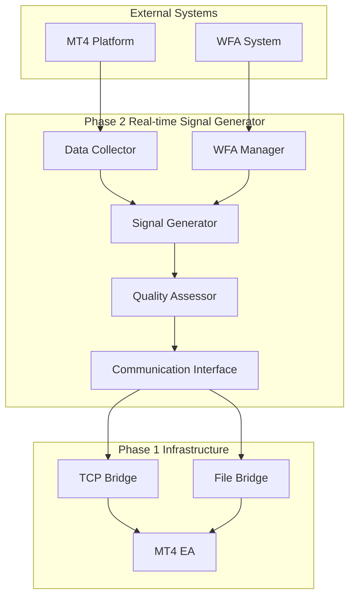
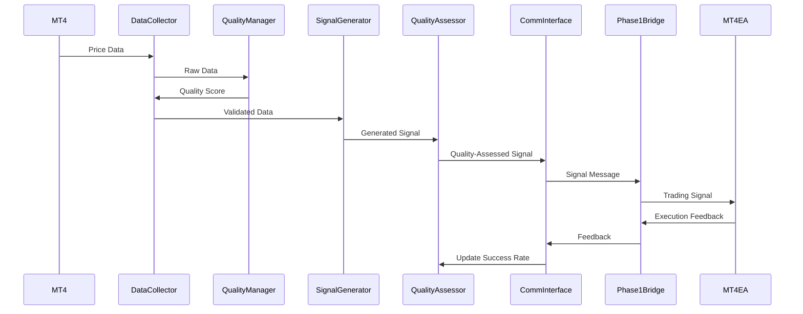
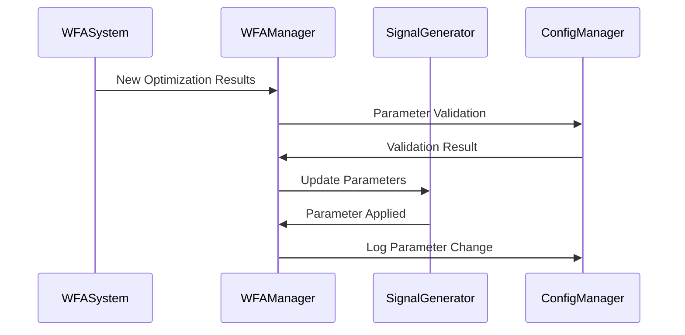

# Phase 2 アーキテクチャ設計書 - リアルタイムシグナル生成システム

**作成日時**: 2025-07-18  
**フェーズ**: Phase 2 - Real-time Signal Generator  
**設計レベル**: 詳細設計  
**前提**: Phase 1通信インフラ完了（A+評価）  

## 🏗️ システムアーキテクチャ概要

### 全体アーキテクチャ



### コンポーネント階層

```
Phase 2 Real-time Signal Generator
├── 1. Data Layer
│   ├── Real-time Data Collector
│   ├── Data Quality Manager
│   └── Data Buffer Manager
├── 2. Processing Layer
│   ├── Signal Generator Engine
│   ├── WFA Parameter Manager
│   └── Quality Assessor
├── 3. Integration Layer
│   ├── Communication Interface
│   ├── Phase 1 Bridge Adapter
│   └── Configuration Manager
└── 4. Monitoring Layer
    ├── Performance Monitor
    ├── Health Checker
    └── Alert Manager
```

## 🔧 詳細コンポーネント設計

### 1. Data Layer

#### 1.1 Real-time Data Collector
**責任**: MT4から価格データをリアルタイム取得

**インターフェース**:
```python
class RealTimeDataCollector:
    def __init__(self, symbols: List[str], update_interval: float = 0.1):
        pass
    
    async def start_collection(self) -> None:
        """データ収集開始"""
        pass
    
    async def stop_collection(self) -> None:
        """データ収集停止"""
        pass
    
    def get_latest_price(self, symbol: str) -> Optional[PriceData]:
        """最新価格取得"""
        pass
    
    def subscribe_price_updates(self, callback: Callable) -> None:
        """価格更新コールバック登録"""
        pass
```

**データ構造**:
```python
@dataclass
class PriceData:
    symbol: str
    timestamp: datetime
    bid: float
    ask: float
    volume: int
    spread: float
    quality_flag: bool
```

#### 1.2 Data Quality Manager
**責任**: データ品質検証・異常値検出

**品質チェック項目**:
- スパイク検出（前回価格との乖離率）
- データ欠損検出（タイムスタンプ間隔）
- スプレッド異常検出（通常スプレッドとの比較）
- ボラティリティ異常検出（移動平均からの乖離）

**インターフェース**:
```python
class DataQualityManager:
    def validate_price_data(self, data: PriceData) -> QualityResult:
        """価格データ品質検証"""
        pass
    
    def detect_anomalies(self, data: PriceData) -> List[Anomaly]:
        """異常値検出"""
        pass
    
    def get_quality_score(self, data: PriceData) -> float:
        """品質スコア算出（0.0-1.0）"""
        pass
```

#### 1.3 Data Buffer Manager
**責任**: 価格データの一時保存・履歴管理

**機能**:
- 循環バッファによる効率的メモリ管理
- lookback期間に応じた履歴データ保持
- 高速アクセス用インデックス管理

### 2. Processing Layer

#### 2.1 Signal Generator Engine
**責任**: ブレイクアウト判定・取引シグナル生成

**アルゴリズム**:
```python
class BreakoutSignalGenerator:
    def __init__(self, lookback_period: int):
        self.lookback_period = lookback_period
        self.high_threshold = None
        self.low_threshold = None
    
    def update_parameters(self, wfa_params: WFAParameters) -> None:
        """WFA最適パラメータ更新"""
        pass
    
    def generate_signal(self, price_data: List[PriceData]) -> TradingSignal:
        """ブレイクアウトシグナル生成"""
        # 1. 過去lookback_period期間の高値・安値計算
        # 2. 現在価格とのブレイクアウト判定
        # 3. シグナル生成（BUY/SELL/NONE）
        pass
    
    def calculate_breakout_levels(self, price_data: List[PriceData]) -> Tuple[float, float]:
        """ブレイクアウトレベル計算"""
        pass
```

**シグナル生成フロー**:
```
価格データ → ブレイクアウトレベル計算 → 閾値判定 → シグナル生成 → 信頼度評価
```

#### 2.2 WFA Parameter Manager
**責任**: WFA最適化結果の管理・適用

**機能**:
- WFA最適化結果の自動読み込み
- パラメータ変更の無停止更新
- パラメータ履歴管理・ロールバック

```python
class WFAParameterManager:
    def __init__(self, wfa_result_path: str):
        self.current_params = None
        self.param_history = []
    
    def load_wfa_results(self) -> WFAParameters:
        """WFA最適化結果読み込み"""
        pass
    
    def update_parameters(self, new_params: WFAParameters) -> bool:
        """パラメータ更新"""
        pass
    
    def rollback_parameters(self) -> bool:
        """パラメータロールバック"""
        pass
    
    def validate_parameters(self, params: WFAParameters) -> bool:
        """パラメータ妥当性検証"""
        pass
```

#### 2.3 Quality Assessor
**責任**: シグナル品質評価・信頼度算出

**評価指標**:
- 市場ボラティリティ考慮
- データ品質スコア
- ブレイクアウト強度
- 過去シグナル成功率

```python
class SignalQualityAssessor:
    def assess_signal_quality(self, signal: TradingSignal, 
                            market_data: MarketData) -> QualityAssessment:
        """シグナル品質評価"""
        pass
    
    def calculate_confidence_score(self, signal: TradingSignal) -> float:
        """信頼度スコア算出"""
        pass
    
    def update_success_rate(self, signal_id: str, success: bool) -> None:
        """シグナル成功率更新"""
        pass
```

### 3. Integration Layer

#### 3.1 Communication Interface
**責任**: Phase 1通信インフラとの統合

**通信フロー**:
```
Signal Generator → Communication Interface → Phase 1 Bridge → MT4 EA
```

```python
class CommunicationInterface:
    def __init__(self, tcp_bridge: TCPBridge, file_bridge: FileBridge):
        self.tcp_bridge = tcp_bridge
        self.file_bridge = file_bridge
    
    async def send_signal(self, signal: TradingSignal) -> bool:
        """シグナル送信"""
        pass
    
    async def send_parameter_update(self, params: WFAParameters) -> bool:
        """パラメータ更新送信"""
        pass
    
    def register_mt4_feedback_handler(self, handler: Callable) -> None:
        """MT4フィードバック処理登録"""
        pass
```

#### 3.2 Phase 1 Bridge Adapter
**責任**: Phase 1インターフェースとの適合

**適合機能**:
- Phase 2メッセージ形式 → Phase 1メッセージ形式変換
- 通信プロトコル統合
- エラーハンドリング統合

#### 3.3 Configuration Manager
**責任**: 設定管理・動的更新

**設定項目**:
- 監視通貨ペア
- データ更新間隔
- シグナル生成閾値
- 品質評価パラメータ

### 4. Monitoring Layer

#### 4.1 Performance Monitor
**責任**: システム性能監視

**監視項目**:
- 処理レイテンシ
- メモリ使用量
- CPU使用率
- シグナル生成頻度

#### 4.2 Health Checker
**責任**: システム健全性監視

**チェック項目**:
- 各コンポーネント生存確認
- データ流入状況
- 通信状態
- エラー発生率

#### 4.3 Alert Manager
**責任**: アラート管理・通知

**アラート種別**:
- 異常データ検出
- 処理遅延発生
- 通信エラー
- システム異常

## 🔄 データフロー設計

### メインデータフロー



### WFA統合フロー



## 🎯 性能設計

### 処理時間目標

| 処理段階 | 目標時間 | 備考 |
|----------|----------|------|
| データ取得 | <10ms | MT4からの価格データ取得 |
| データ品質チェック | <5ms | 異常値検出・品質スコア算出 |
| シグナル生成 | <30ms | ブレイクアウト判定・シグナル生成 |
| 品質評価 | <15ms | 信頼度スコア算出 |
| 通信処理 | <40ms | Phase 1ブリッジ経由送信 |
| **合計** | **<100ms** | **エンドツーエンド処理時間** |

### メモリ使用量設計

| コンポーネント | メモリ使用量 | 備考 |
|----------------|--------------|------|
| Data Buffer | 50MB | 5通貨ペア × 10,000ポイント履歴 |
| Signal Generator | 30MB | 計算用ワーキングメモリ |
| Quality Assessor | 20MB | 履歴データ・統計情報 |
| 通信バッファ | 10MB | メッセージキュー |
| **合計** | **110MB** | **最大メモリ使用量** |

## 🛡️ 信頼性設計

### エラーハンドリング戦略

```python
class ErrorHandlingStrategy:
    def handle_data_error(self, error: DataError) -> None:
        """データエラー処理"""
        # 1. エラーログ記録
        # 2. 代替データ源確認
        # 3. 品質フラグ更新
        # 4. 必要に応じてアラート発行
        pass
    
    def handle_processing_error(self, error: ProcessingError) -> None:
        """処理エラー処理"""
        # 1. 処理状態保存
        # 2. エラー分類・重要度判定
        # 3. 自動復旧試行
        # 4. 復旧不可の場合はフェイルセーフ
        pass
    
    def handle_communication_error(self, error: CommunicationError) -> None:
        """通信エラー処理"""
        # 1. Phase 1エラーハンドリング活用
        # 2. フォールバック機構使用
        # 3. 再送試行
        # 4. エラー状況監視
        pass
```

### 自動復旧機能

- **プロセス異常**: 3回まで自動再起動
- **データ欠損**: 代替データ源・補完処理
- **通信障害**: Phase 1フォールバック機構
- **パラメータ異常**: 前回正常パラメータに自動復旧

## 📊 監視・運用設計

### 監視ダッシュボード

```yaml
Real-time Metrics:
  - 処理レイテンシ（リアルタイム）
  - シグナル生成頻度（1分間隔）
  - データ品質スコア（リアルタイム）
  - システム稼働状況（リアルタイム）

Historical Metrics:
  - シグナル成功率（日次・週次）
  - パフォーマンス傾向（週次・月次）
  - エラー発生統計（日次）
  - システム使用率（日次）
```

### ログ設計

```python
class LoggingStrategy:
    def log_signal_generation(self, signal: TradingSignal) -> None:
        """シグナル生成ログ"""
        pass
    
    def log_performance_metrics(self, metrics: PerformanceMetrics) -> None:
        """性能メトリクスログ"""
        pass
    
    def log_error_events(self, error: Exception) -> None:
        """エラーイベントログ"""
        pass
    
    def log_system_health(self, health_data: HealthData) -> None:
        """システムヘルスログ"""
        pass
```

## 🔒 セキュリティ設計

### データセキュリティ
- 価格データの暗号化保存
- 設定ファイルの暗号化
- 通信データの暗号化（Phase 1活用）

### アクセス制御
- プロセス間通信の認証
- 設定変更の権限管理
- ログアクセスの監視

## 📈 拡張性設計

### 水平拡張
- 複数通貨ペアの並列処理
- 複数シグナル生成戦略の同時実行
- 負荷分散機能

### 垂直拡張
- 高度な品質評価アルゴリズム
- 機械学習による信頼度予測
- 複雑な市場分析機能

## 🚀 実装優先度

### Phase 2.1 (最優先)
1. Real-time Data Collector
2. Signal Generator Engine
3. Communication Interface
4. 基本的なエラーハンドリング

### Phase 2.2 (高優先)
1. Quality Assessor
2. WFA Parameter Manager
3. 性能監視機能
4. 統合テスト

### Phase 2.3 (中優先)
1. 高度な監視・アラート
2. 設定管理機能
3. 拡張性対応
4. 最適化・チューニング

---

**設計承認**: Phase 2アーキテクチャ設計完了  
**次工程**: Phase 2技術仕様書作成  
**実装準備**: Phase 2.1実装開始可能  
**レビュー**: Gemini査読予定