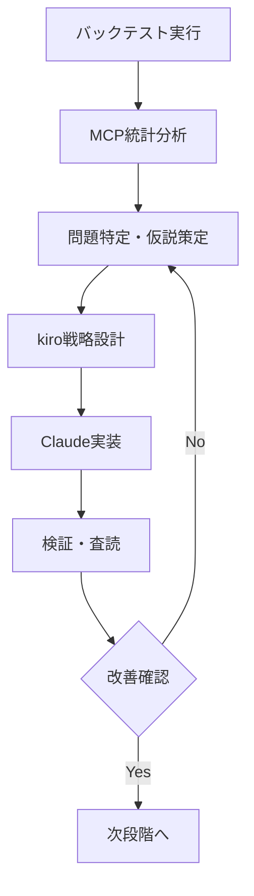

# 開発プロセス統合ガイド（2025年版）

## 📋 目次
1. [分業体制設計](#分業体制設計)
2. [段階的実行プロセス](#段階的実行プロセス)
3. [改善フロー設計](#改善フロー設計)
4. [実行管理](#実行管理)

---

## 1. 分業体制設計

### 🎯 基本方針
**kiro-Claude協働による専門性活用**
- **kiro**: 戦略・設計・判断（アーキテクト）
- **Claude**: 実装・実行・検証（エンジニア）

### 👥 詳細役割分担

#### kiro担当領域（戦略・設計）
- 改善仮説の策定・優先順位決定
- 戦略ロジックの根本設計
- リスク許容度・目標設定
- アーキテクチャ設計・承認

#### Claude担当領域（実装・実行）
- kiro設計書に基づく実装
- バックテスト実行・データ収集
- 統計分析・検証作業
- 技術的問題解決

### ✅ 協働品質保証
- **設計駆動開発**: kiro設計書準拠の確実実装
- **段階的承認**: 各Phase完了時の品質確認
- **相互補完**: 戦略的思考×技術実装の最適組合せ

---

## 2. 段階的実行プロセス

### 🔄 設計思想
**確実性重視の原則**
- **Small Steps**: 小さな成功の積み重ね
- **Gate Control**: 各段階での品質確認ゲート
- **Risk Mitigation**: 早期問題発見・対処
- **Continuous Validation**: 継続的第三者検証

### 📊 段階設計基準
```yaml
段階分割基準:
  - 1段階 = 1-3日で完了可能な作業単位
  - 明確な成果物・検証可能な結果
  - 失敗時の影響範囲限定
  - 次段階への依存関係明確化

品質保証基準:
  - 各段階完了時の必須チェック項目
  - 定量的成功基準の事前設定
  - 第三者検証・承認プロセス
  - 問題発生時の対処手順
```

### 🎯 標準実行フロー

#### Phase 0: 設計・承認段階
1. **Claude**: フロー設計提案
2. **kiro**: アーキテクチャ設計・承認
3. **Claude**: 詳細実装仕様作成
4. **承認完了**: Phase1開始

#### Phase 1: 現状完全数値化（2-3日）
1. **データ収集**: バックテスト結果・統計指標
2. **分析実行**: MCP統計システム活用
3. **問題特定**: ボトルネック・改善点抽出
4. **検証**: Gemini査読・品質確認

#### Phase 2: 改善案設計（1-2日）
1. **仮説策定**: kiro戦略設計
2. **実装計画**: Claude技術仕様作成
3. **リスク評価**: 影響範囲・対処法
4. **承認**: kiro最終承認

#### Phase 3: 実装・検証（2-4日）
1. **実装実行**: EA修正・パラメータ調整
2. **テスト実行**: バックテスト・統計分析
3. **結果評価**: 改善効果測定
4. **最終検証**: Gemini査読・品質確認

---

## 3. 改善フロー設計

### 🎯 バックテスト分析後の標準フロー

#### MCP最大活用による自動化
- **統計計算**: MCP統計システムで高速処理
- **データ変換**: 自動フォーマット変換
- **結果可視化**: 自動レポート生成

#### データ駆動改善サイクル


#### 品質保証システム
- **各段階での検証**: 定量的基準によるチェック
- **第三者査読**: Gemini専門家レビュー
- **承認プロセス**: kiro最終決定

---

## 4. 実行管理

### 📋 進捗管理
**TodoWrite活用**
- 各段階のタスク明確化
- リアルタイム進捗追跡
- 完了基準の明確化

### 🔍 品質管理
**継続的監視**
- 各段階完了時の品質チェック
- 定量的成功基準による評価
- 問題発生時の早期対処

### 📊 成果測定
**定量的評価指標**
- 開発効率（日数・工数）
- 品質指標（バグ発生率・修正時間）
- 成果指標（戦略改善効果）

---

## 🎯 実践ガイドライン

### 開始時チェックリスト
- [ ] kiro設計書の準備確認
- [ ] 必要リソース（MCP・Gemini）の動作確認
- [ ] 品質基準・成功基準の事前設定
- [ ] 段階分割・スケジュール策定

### 実行時注意事項
- 段階完了時は必ず品質チェック実行
- 問題発生時は即座にkiroに報告・相談
- 第三者査読は必須（Gemini活用）
- 成果は定量的に測定・記録

### 完了時確認事項
- [ ] 全段階の品質基準クリア
- [ ] 第三者査読完了
- [ ] 成果の定量的確認
- [ ] 次回改善点の抽出・記録

---

**作成日**: 2025年7月25日
**統合者**: Claude（実装担当）
**承認者**: kiro（設計責任者）
**対象**: JamesORB戦略改善プロセス
